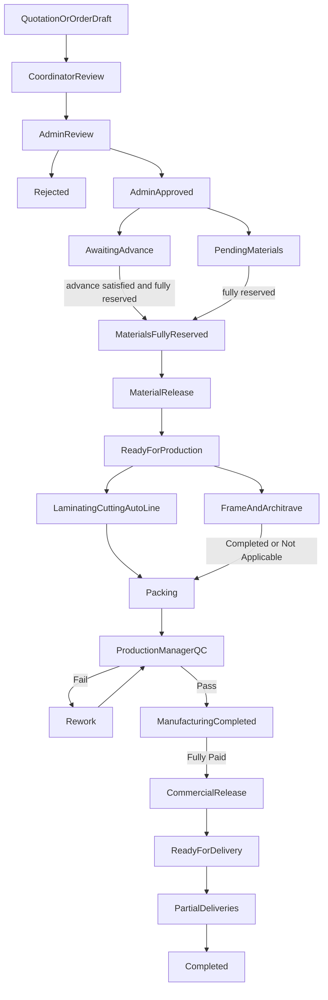

# Sindean Factory Domain Specification

Status: domain specification only. No implementation is authorized by this file.  
Date: 4 October 2026.

Revision: the customer could not answer the open business questions consistently and delegated process planning to this product. This revision records those product decisions and applies them through the lifecycle, inventory, commercial, and control sections. It does not implement them.

This document defines the operational domain of the Sindean Doors factory. It is the agreement a developer should follow so the factory workflow is not guessed from the current screens.

## How to read this document

Each topic uses three evidence layers.

| Label | Meaning |
| --- | --- |
| FACTS | Stated in `docs/customer-requirements.pdf`, or carried forward from that PDF in `docs/DOMAIN_LEARNINGS.md` and `docs/PRODUCTION_GAP_ANALYSIS.md`. FACTS stay as historical source evidence. A later product decision does not rewrite them. |
| CURRENT IMPLEMENTATION | What this repository does today. The code is evidence of the software, not evidence of the correct process. |
| DECIDED DOMAIN BEHAVIOR | The target process. It keeps PDF rules that still stand, and it adds rules decided after the customer delegated process design. |

**PRODUCT DECISION** and **DECIDED DOMAIN BEHAVIOR** mean the same kind of rule: a choice made in this product after that delegation. They are not claims that the customer PDF originally specified the rule.

When a PDF sentence conflicts with a product decision, both remain in the document. The PDF sentence stays under FACTS. The product decision supersedes it for what the system must do.

Sources, in this order when they disagree about what the customer originally wrote:

1. `docs/customer-requirements.pdf`
2. The extracted factory rules in `docs/DOMAIN_LEARNINGS.md` and `docs/PRODUCTION_GAP_ANALYSIS.md`
3. The working tree: `drizzle/schema.ts` and the tRPC routers

The target process is this specification's decided behavior, which may supersede a PDF sentence. Decision IDs from the previous open list are kept for traceability. There is no OPEN-02.

Page 6 of the PDF is a flowchart image. Text extraction returned no words from that page. PDF rules below come from the written pages, not from an unread diagram.

This specification does not introduce multi-tenancy, a second product, or a generic manufacturing model.

**DOMAIN READY** means the business rule is decided. **CONFIGURATION READY** means the master data and settings required to operate that rule exist. **TECHNICALLY IMPLEMENTED** means this repository enforces the decided rule. A decided rule is not production-ready by itself.

---

## 1. Actors and roles

### 1.1 Admin

**FACTS.** Admin is the accountant. There is no separate accounting role. Admin uses a desktop. Admin has full authority over the control panel and the system. That phrase means administrative and system oversight, plus the duties this document names for Admin. It does not copy an operational duty onto Admin when the PDF assigns that duty to another role. Admin reviews every new order, approves it or rejects it with a written reason. The PDF says that approval is the moment the order's required component quantities are deducted. Admin follows payments and confirms amounts received from sales representatives. Admin can see every order and the full audit history of any order. The PDF does not assign order entry to Admin.

**CURRENT IMPLEMENTATION.** One shared password (`ADMIN_PASSWORD_HASH` or `ADMIN_INTERNAL_KEY`) creates an `adminSession` cookie. `adminProcedure` in `server/trpc.ts` is the only staff gate. There is no per-person admin identity. `orders.updateStatus` in `server/routers.ts` can set any door status, including `confirmed`, with no reason and with no inventory deduction. Confirmation starts `createInvoiceFromOrder` and ignores failure.

**DECIDED DOMAIN BEHAVIOR.** One Admin role, who is also the accountant. More than one person may hold that role. Each person has an individual user identity. A shared password is not the target identity model. This identity rule is a **PRODUCT DECISION** (OPEN-26 for production workers, and OPEN-25 because audit must name the actual person). Disabling an account does not rewrite historical audit.

Admin reviews, approves, and rejects. Rejection stores a reason. **PRODUCT DECISION (OPEN-04).** Admin Approval means the order is commercially and administratively approved. Admin Approval does not deduct stock, does not create the Material Issue, and does not by itself make the order Ready for Production.

Admin confirms payments collected by sales. Fully Paid is calculated from payment records. Admin does not type a Fully Paid flag (OPEN-20). Admin can read every order, internal stock quantities, and the audit history.

**PRODUCT DECISION.** Admin alone gives final approval for cancellation (OPEN-03), financial refunds (OPEN-22), published BOM versions (OPEN-18), urgent reservation-priority overrides (OPEN-16), and Change Requests after Material Release (OPEN-08). Admin does not perform team Start or Complete, formal QC, commercial release, or the Stock Manager's stock movements. When a future adjustment threshold is configured, unusually large stock adjustments require Admin approval before they post (OPEN-15). No threshold is hardcoded now.

### 1.2 Sales Coordinator

**FACTS.** Desktop role at the factory. Receives walk-in customers. Creates customer accounts (this role or Admin only). Creates orders: customer data, door groups, a measurement per door, photos of the original measurements, and the advance payment. Sends the order to Admin for review. Reviews sales-person orders and may change them before Admin processes them. Adds notes that are general or aimed at one production team. After manufacturing is complete and the full amount is paid, issues the commercial release (`أمر الصرف`).

**CURRENT IMPLEMENTATION.** No Sales Coordinator account, queue, or procedure.

**DECIDED DOMAIN BEHAVIOR.** The coordinator can create customers, quotations, and direct orders, attach measurement evidence, record an advance as a real payment record, review and edit a sales person's order before it is with Admin, add general and team-specific notes, and send the order for Admin review. Quotation is supported and is not mandatory (OPEN-12).

**PRODUCT DECISION (OPEN-08).** Before Material Release, the coordinator can still process production-critical changes. If the order is already approved, a material or specification change may require renewed review, BOM recalculation, reservation recalculation, or reapproval. After Material Release, the coordinator cannot silently edit production-critical order data. Those changes are a Change Request.

**PRODUCT DECISION (OPEN-07).** The coordinator manually issues the Commercial Release. The server enables that action only when QC Passed and calculated Fully Paid are both true. The coordinator cannot issue it earlier. Delivery still requires that release.

The coordinator may request cancellation (OPEN-03) and may request a refund (OPEN-22). Neither request cancels the order or moves money by itself. Color answers for this sales desk role are YES or NO, without an on-hand quantity (OPEN-10).

### 1.3 Sales Person

**FACTS.** Field role (المندوب). Measurements are taken on paper at the customer site and entered later, with photos of the original measurements. Creates orders. The order goes to the Sales Coordinator before Admin. May change their own order until manufacturing has started. Sees only orders they created. Does not see other sales people's orders or the coordinator's orders. May ask whether a color is available and receives YES or NO only, never a quantity.

**CURRENT IMPLEMENTATION.** No Sales Person user, ownership column, or color query. `orders.create` is public. Job-order and workflow screens show hardcoded availability and, in places, quantities (`client/src/pages/admin/AdminJobOrderDetail.tsx`, `client/src/components/admin/OrderWorkflowModal.tsx`).

**DECIDED DOMAIN BEHAVIOR.** A sales person creates and later completes their own quotations or direct orders, uploads measurement evidence, and submits through the coordinator. Server queries for their orders filter by their identity.

**PRODUCT DECISION (OPEN-08).** The PDF edit lock, "until manufacturing has started," is superseded. The lock point is Material Release. Before that point, the sales person can still change production-critical data on their own order, subject to the same reapproval and recalculation rules as the coordinator when the order is already approved. After Material Release, silent edits are forbidden. A Change Request is required.

**PRODUCT DECISION (OPEN-10).** Color availability is YES only when the color is active and Available quantity is at least the configured Sales Availability Threshold. Available means On Hand minus Reserved. The sales person never receives the quantity. A general YES does not reserve stock and does not guarantee a later order quantity.

The sales person may request cancellation and may request a refund. They cannot approve either.

### 1.4 Stock Manager

**FACTS.** Desktop role. Receives raw materials from suppliers and records them. Receives an automatic material issue for every approved order, with the components and quantities (the PDF example lists doors, architraves, locks, hinges, and rubber length). Prepares those materials and carries them to the five teams. That carry is physical and is not locked by a platform button. Watches shortages and raises low-stock alerts. Runs day-to-day receipt and issue.

**CURRENT IMPLEMENTATION.** Inventory mutations are `adminProcedure` in `server/inventory.router.ts`. Receipt is an admin `addTransaction` of type `receive`. There is no material-issue record. Low stock is `currentQty <= minQty`. Purchase-order status `delivered` does not receive stock.

**DECIDED DOMAIN BEHAVIOR.** The stock manager records supplier receipts and ordinary issues as stock movements. They read the Material Issue created at Material Release. They watch shortages. They do not need a "materials handed to the teams" confirmation to unblock production. They use the calculated BOM and do not redefine the general manufacturing formula (OPEN-18).

**PRODUCT DECISION (OPEN-04, OPEN-16).** The material issue is no longer an effect of Admin Approval. It is created when Material Release runs. Until then, the stock manager sees reservation and shortage information.

**PRODUCT DECISION (OPEN-15).** The stock manager can post controlled stock adjustments. An adjustment is its own movement, distinct from receipt and issue. The balance is never edited in place. Each adjustment stores item, before, adjustment quantity, after, reason, actor, and time. A future configurable threshold may require Admin approval for unusually large adjustments. No financial or quantity threshold is hardcoded.

**PRODUCT DECISION (OPEN-03, OPEN-05).** After a cancellation that follows Material Release, the stock manager performs Cancellation Material Reconciliation. For rework, the Production Manager records the operational need and the stock manager posts Rework Material Issue or Rework Material Return. The stock manager does not commercially cancel an order and does not approve a refund.

### 1.5 Production Manager

**FACTS.** iPad-first. Responsible for all five teams. Watches the floor continuously. That watching is not a formal QC stage. The only formal QC is when the order reaches Packing, and this person performs it. A defect is Rework to the responsible team, with a reason. A sound order gets a manual QC Passed action before the customer is shown that it is ready. After QC Passed, full payment, and the commercial release, this person delivers the order in full or in parts and records date, quantity, photos, and notes.

**CURRENT IMPLEMENTATION.** `supervisorName` is free text on `work_orders`. QC inspections store a free-text inspector. Packing stages are status flags. There is no Production Manager login and no QC Passed gate.

**DECIDED DOMAIN BEHAVIOR.** The production manager can see all five teams, record QC fail as a Rework Ticket to one responsible team with a reason, record QC Passed, and record full or partial delivery. Informal watching does not create a system stage. The production manager participates in defining and testing BOM rules. Admin publishes those versions (OPEN-18).

**PRODUCT DECISION (OPEN-05).** If rework needs extra material, the production manager records and approves that operational need. The stock manager posts the movement.

**PRODUCT DECISION (OPEN-03, OPEN-22).** The production manager may report a cancellation-related production issue. That report does not commercially cancel the order and does not refund the customer.

**PRODUCT DECISION (OPEN-06, OPEN-21).** Each delivery names the delivered Door IDs. Quantity is derived from those doors. The order is completed only when every required door has been delivered.

**PRODUCT DECISION (OPEN-07).** Commercial Release cannot be issued before QC Passed, and it also requires calculated Fully Paid. The production manager does not issue that release. Delivery still waits for it.

**PRODUCT DECISION (OPEN-26).** The production manager is an individual user. Holding that role does not by itself authorize another team's Start or Complete.

### 1.6 Production teams

**FACTS.** Five teams, each iPad-first:

| Team | Documented work |
| --- | --- |
| Laminating | Applies the requested color to the raw door. First manufacturing step in the team chapter. Sees the order number, full order detail, door measurements, and sales notes. Start, then Complete. May add a note. |
| Cutting | Described as receiving the door after laminating. Cuts each door to the customer's size. Sees every door measurement. Prints a temporary sticker per door, or for the whole order: order number, door number, and size only. No customer name and no delivery date. The sticker is finished with once the door reaches Auto Line. |
| Auto Line | Described as receiving the door after cutting. Edge banding, then the lock seat. Same Start / Complete pattern. |
| Frame & Architrave | Independent of Laminating, Cutting, and Auto Line. Produces frames and architraves to the order: frame sizes, architrave sizes, and the chosen color. |
| Packing | Last stage. Receives the finished door from Auto Line and the frame and architrave from Frame & Architrave after both paths are done. Numbers doors the way the customer numbered them, packs the order, and prints the final sticker: order number, door number, size, and other identification details. This stage is where formal QC happens. |

Shared team rules from the PDF:

- Start and Complete act on the whole order, not on one door.
- A team may add a note.
- Urgent orders show a clear red alert on that team's card.
- When a team completes, the order appears on that team's completed list and is visible to the other teams and the Production Manager.
- No team manages inventory. Materials arrive from the stock manager in person.
- Rework returns to the responsible team only.

The design principles also say the five teams work in complete parallel and any team may start at any time.

**CURRENT IMPLEMENTATION.** Departments in `client/src/pages/admin/AdminWorkOrders.tsx` and `server/production.router.ts` are `door_line`, `frame_line`, `accessories`, `qc`, and `packing`. Progress is `completedQty` on a department task. There is no team login and no iPad queue. The names Laminating, Cutting, Auto Line, and Architrave do not appear in the application.

**DECIDED DOMAIN BEHAVIOR.** Five team roles with those names. Start and Complete stay order-level. Teams cannot post stock. Urgent orders are red. A completed team state is visible to the other teams and the Production Manager.

**PRODUCT DECISION (OPEN-01).** The design-principles sentence that any team may start at any time stays in FACTS and is not the enforced rule. For one order, Laminating, then Cutting, then Auto Line, run as a door path. Frame & Architrave runs in parallel with that path when the effective BOM Snapshot contains frame or architrave components or manufacturing work. Packing becomes eligible only when Auto Line is Complete and Frame & Architrave is Complete or Not Applicable. Each team may see future work in an Upcoming queue before it is eligible. Conceptual states are Upcoming, Ready, In Progress, and Completed. Not Applicable is not a state a worker selects. Start is server-enforced and is available only when that team's dependencies are satisfied.

**PRODUCT DECISION (OPEN-26).** There is no shared login per team. Each worker has an individual user and one or more team roles assigned by Admin. Audit records that person. Shared iPads are allowed, with a factory login such as a personal PIN, badge or QR, later NFC, quick user switch, and inactivity lock. The server authorizes the user, not the device. A Cutting worker cannot perform Laminating actions because they are standing at the Laminating station. Disabling the account does not damage historical audit identity.

Physical material handoff remains a person carrying material. It is not a button and it is not a Start gate.

**PRODUCT DECISION (OPEN-01).** If the effective BOM Snapshot contains no components or manufacturing work that require the Frame & Architrave team, the server sets that path to Not Applicable. The worker cannot choose Not Applicable as a shortcut. The derived routing decision is audited. A later change to whether that path is required is recalculated only through an approved Change Request, not by a team action.

### 1.7 QC responsibilities

**FACTS.** QC is not a sixth production team and not a separate role in the role table. The Production Manager performs the only formal QC, at Packing. Pass and fail are defined in section 7.

**CURRENT IMPLEMENTATION.** QC is a work-order department, two workflow stages (`incoming_qc`, `final_qc`), and `qc_inspections.qc_type` values `incoming`, `final`, and `po_matching`.

**DECIDED DOMAIN BEHAVIOR.** Formal QC is the Production Manager's action at Packing. Do not add a mandatory QC stage per team.

**PRODUCT DECISION (OPEN-07).** QC Passed is a precondition of Commercial Release. Delivery still requires the release as well as QC Passed and calculated Fully Paid.

### 1.8 Customer

**FACTS.** Mobile-first portal. The account is created by the Sales Coordinator or Admin. The customer cannot create an order. They can track the order and see current production progress, ask color availability as YES or NO, submit a complaint or question on one of their orders with images, see only their own history, and receive a WhatsApp when manufacturing is complete and the order is ready.

**CURRENT IMPLEMENTATION.** `users` may self-register. `orders.create` is public. `customerPortal.myOrders` filters `door_orders.customer_email`. `trackOrder` is public by phone or email and returns price and payment status. Customer complaint insert writes `images: []`. `client/src/pages/user/UserOrders.tsx` still has a mock data path. WhatsApp is a manual `wa.me` link.

**DECIDED DOMAIN BEHAVIOR.** Section 11. The customer does not create orders. Progress is a derived customer-facing status, not the internal workflow and not a status typed by staff (OPEN-23). Color answers are YES or NO only (OPEN-10). The first required customer notification is QC Passed / manufacturing completion, and that message must not claim the order is ready for physical delivery when payment or Commercial Release is still incomplete (OPEN-14).

### 1.9 Distributor

**FACTS.** The customer PDF does not define a distributor role.

**CURRENT IMPLEMENTATION.** `distributors` are outside companies with their own password, orders (`distributor_orders`), and a portal. Confirming a distributor order inserts `door_orders` rows and stores `DIST_ORDER_ID:{id}` in `notes`. This is not the sales person in the PDF.

**DECIDED DOMAIN BEHAVIOR.** **PRODUCT DECISION (OPEN-11).** The Distributor Portal is not part of the core first go-live. Do not delete the existing code in this documentation pass. It stays outside the canonical factory workflow and is not a dependency of that workflow. Unsafe anonymous sensitive mutations are closed immediately, as a security invariant, not as a portal redesign. Later, distributor ordering should be redesigned as an Order Source that feeds the same canonical order. It must not keep a parallel order architecture or a second commercial truth.

### 1.10 Supplier

**FACTS.** The PDF says the stock manager receives raw materials from suppliers and records them. It does not describe a supplier login, an RFQ auction, or a supplier portal.

**CURRENT IMPLEMENTATION.** `suppliers` plus `supplier_sessions`. Most RFQ and purchase-order mutations in `server/rfq.router.ts` are `publicProcedure`. Marking a purchase order `delivered` stores a timestamp and does not increase inventory.

**DECIDED DOMAIN BEHAVIOR.** Supplier remains a business and master-data party for material receipts recorded by the Stock Manager. **PRODUCT DECISION (OPEN-11).** Supplier login and the RFQ portal are not required for first go-live and are not part of the canonical factory workflow. Do not delete that code yet. Do not let factory production depend on it. A delivered purchase-order flag is not a stock receipt until the Stock Manager posts a receipt movement. Public RFQ and purchase-order mutations are closed immediately.

---

## 2. Order lifecycle

### FACTS

The PDF requires one traceable order from creation through final delivery, with this operational chain:

Customer or sales contact, then Sales Coordinator or Sales Person, then Admin, then inventory, then the five production teams, then the Production Manager, then delivery.

Written events that are explicit:

1. Sales Person or Sales Coordinator creates the order (measurements may be completed after a field visit).
2. A sales person's order is reviewed by the coordinator, who may edit it, and is then sent to Admin.
3. Admin approves or rejects. Rejection has a reason. The PDF says approval deducts inventory and creates the material issue.
4. The stock manager prepares materials. The five teams manufacture. Packing is the last production stage and the formal QC point.
5. QC Passed is manual, before the customer sees the order as ready.
6. When manufacturing is complete and the full amount is paid, the coordinator issues the commercial release.
7. The production manager delivers, in full or in parts, after QC Passed, full payment, and the release.

The word "quotation" appears in the rule that one number runs from quotation through delivery. The PDF does not define a quotation document, a quotation status, or a customer RFQ.

### CURRENT IMPLEMENTATION

Two commercial records exist.

- `door_orders.status`: `new`, `reviewing`, `confirmed`, `in_production`, `ready`, `delivered`, `cancelled`. Any of these can be written from any of these. `updateWorkflowStage` does not change `status`.
- `door_orders.workflow_stage` defaults to `po_review`. The UI lists 15 stages from `po_review` through `post_order_review` (`client/src/pages/admin/AdminWorkflow.tsx`). The server accepts any string up to 50 characters.
- `distributor_orders` has its own status and number. Child door rows are linked by a notes prefix.
- `work_orders.status`: `draft`, `issued`, `in_progress`, `completed`, `on_hold`, `cancelled`.
- No `db.transaction` wraps a status change.

The 15-stage board is not the factory lifecycle. It includes sample approval, incoming QC, PO matching, and post-order review, which the PDF does not use as floor stages.

### DECIDED DOMAIN BEHAVIOR

**PRODUCT DECISION (OPEN-04, OPEN-12, OPEN-01, OPEN-07, OPEN-06).** The PDF sentence that Admin Approval itself deducts inventory is superseded. Approval is commercial. Stock is deducted at Material Release, after reservation is complete and the configured advance is satisfied.

The conceptual lifecycle is:

1. Quotation or Order Draft. A versioned customer quotation may exist on the same canonical number. Quotation is not mandatory. A direct order may be entered. Supplier RFQ is not this quotation.
2. Coordinator Review for a sales person's commercial object. A coordinator-created object can be sent to Admin without a second sales-person review.
3. Admin Review.
4. Admin Approved, or Rejected with a reason.
5. After approval, the order may be Approved – Awaiting Advance, Approved – Pending Materials, or both.
6. Inventory Reservation starts only after Admin Approval and after the required advance is satisfied. Partial reservation is allowed. The order stays Pending Materials until every required component is fully reserved.
7. Materials Fully Reserved.
8. Material Release. This commits manufacturing and locks silent sales edits.
9. Ready for Production.
10. Laminating, then Cutting, then Auto Line, in parallel with Frame & Architrave.
11. Packing, when Auto Line is Complete and Frame & Architrave is Complete or Not Applicable.
12. Production Manager QC.
13. On QC Fail: Rework to the responsible team, then QC again.
14. On QC Passed: Manufacturing Completed.
15. When QC Passed and Fully Paid are both true, the order is ready for Commercial Release. Payment may already have happened before QC.
16. Sales Coordinator issues Commercial Release.
17. Ready for Delivery.
18. One or more partial deliveries, each naming Door IDs.
19. Completed only when every required door has been delivered.

Cancellation and Change Request are side workflows. They are not alternate happy-path arrows. Refund is a separate financial workflow and is not created by cancellation.

Do not implement the 15-stage board as the floor state machine. Distributor orders are not a second lifecycle.

Awaiting Advance and Pending Materials can both be true. Reservation does not start until the advance condition is satisfied. Partial reservation can continue after that, so Pending Materials does not by itself mean the order is fully reserved. Commercial Release is a separate coordinator action after QC Passed, and only when Fully Paid is also true. Manufacturing Completed can wait there until the balance is satisfied. The diagram does not draw Cancellation, Change Request, or Refund.

---

## 3. A single canonical order number

### FACTS

One number follows the order from quotation through final delivery. Cutting stickers and packing stickers both carry that order number plus the door number. Audit entries are about that order.

### CURRENT IMPLEMENTATION

| Identifier | Where |
| --- | --- |
| Distributor number `SND-{year}-D{random}` | `distributor_orders.order_number` |
| Door primary key, displayed as `SND-{padded id}` | `door_orders.id` in the admin workflow UI |
| Work order number | `work_orders.wo_number`, client-supplied |
| Packing order number | `packing_orders.order_number` |
| Tax invoice number | `tax_invoices`, formatted in the ZATCA service |
| Parent link | `door_orders.notes` prefix `DIST_ORDER_ID:` |

### DECIDED DOMAIN BEHAVIOR

There is one canonical order number. **PRODUCT DECISION (OPEN-12).** Customer quotation revisions use that same number. Quotation Revision 1 and Quotation Revision 2 are versions, not new public numbers. Prior commercial history is never overwritten. The accepted quotation revision is the authoritative commercial basis when a quotation was used. A direct order uses the same number without requiring a quotation. Supplier RFQ numbers are unrelated.

These records reference the canonical number and do not invent a second public number for the same factory order:

- the quotation revisions and the order itself
- each door, including its stable Door ID
- measurement photos
- the advance and later payment records, and any refund records
- the BOM Snapshot, reservations, shortage records, Material Issue, and later rework material documents
- each team's start, complete, note, and rework
- the QC decision
- Change Requests and cancellation requests
- the commercial release
- each delivery, including the delivered Door IDs
- the audit rows
- customer-visible tracking
- external invoice references, if the factory stores them (OPEN-13)

Stickers print this number. A work-order document, a packing sheet, or an external invoice may have its own reference, and the number people say aloud is the canonical one.

Which existing table stores it is an implementation choice, not a new business rule. The notes prefix is not an acceptable link. A distributor order number is not the canonical factory number. Browser-supplied totals are not a second commercial identity.

---

## 4. Inventory lifecycle

The finished door is: door leaf + frame + architrave + lock + hinges + rubber. The factory imports the empty door, frames, architraves, locks, rubber, and hinges. Component quantities come from a versioned BOM Snapshot (OPEN-18), not from hardcoded multipliers.

The stock picture for every item is:

| Quantity | Meaning |
| --- | --- |
| On Hand | Physical quantity recorded by stock movements. |
| Reserved | Quantity allocated to approved orders and not yet released. |
| Available | On Hand minus Reserved. |
| Shortage | Required quantity that is not reserved or not available, stored as its own record. |

Reservation is not consumption. Material Release is the transition that consumes the reservation, deducts On Hand, and creates the Material Issue.

### 4.1 Reservation

**FACTS.** The PDF does not define a reserved quantity, a hold at quotation, or a hold at order entry.

**CURRENT IMPLEMENTATION.** `inventory_items` has `current_qty` only. No reserved column.

**DECIDED DOMAIN BEHAVIOR.** **PRODUCT DECISION (OPEN-16).** Real reservation is part of the target domain. It does not happen at quotation or at draft entry. A color YES does not create a reservation (OPEN-10).

Reservation starts only after both of these are true:

- Admin Approval
- the configured advance requirement is satisfied

The system reserves available material for the order against the BOM Snapshot. If the available quantity cannot cover every component, partial reservation is allowed and the order stays Pending Materials, with shortage records. Reservations stop other orders from consuming that allocated quantity.

When every required component is fully reserved, the order is Materials Fully Reserved and may proceed to Material Release if the other release preconditions are already true.

Cancellation before Material Release releases the reservation only. It does not post a stock return, because On Hand was not deducted.

An approved change before Material Release recalculates the BOM Snapshot and the reservations.

Default reservation priority is earlier production commitment first. Admin may override that priority for an urgent order. The override is audited.

### 4.2 Deduction and Material Release

**FACTS.** The PDF says deduction is full, once, and immediate, and that it happens only when Admin approves. It is not repeated as each team finishes.

**CURRENT IMPLEMENTATION.** `orders.updateStatus` to `confirmed` does not touch inventory. `CreateWorkOrderWizard` calls `consumeMaterialsForWorkOrder` in `client/src/stores/inventoryStore.ts`, which subtracts browser `localStorage`. `server/inventory.router.ts` `consumeForWorkOrder` can deduct in the database, clamps each line to the quantity on hand, is not idempotent, and has no client caller. `addTransaction` clamps the balance at zero with `Math.max(0, newQty)`.

**DECIDED DOMAIN BEHAVIOR.** **PRODUCT DECISION (OPEN-04).** The PDF rule that Admin Approval itself always deducts stock is superseded. Admin Approval does not deduct On Hand.

If required materials are not fully reserved, the order is Approved – Pending Materials. The system keeps shortage information. In that state there is no partial material deduction, no negative stock, no Material Issue that pretends the full quantity was issued, and no production start.

Material Release runs only when the required advance is satisfied, every required component is fully reserved, and the other release preconditions in this specification are true. It then does all of the following in one commit:

- consume and release the full reservation
- deduct the full required component quantities from On Hand
- create one Material Issue for the BOM Snapshot
- set the order to Ready for Production

A repeated Material Release does not deduct those quantities again. Team actions never deduct them. The browser is not a stock ledger.

**PRODUCT DECISION (OPEN-17).** Negative On Hand is forbidden. Shortage is a record, not a negative balance. Do not clamp an invalid deduction to zero and continue. Any stock operation that would reduce On Hand below zero fails, or becomes a shortage or reconciliation process for that domain event. It does not post a partial success and call the movement complete.

### 4.3 Material issue

**FACTS.** The PDF says that after the deduction, the stock manager automatically receives a material issue listing the quantities for that order. The PDF example is a pick list of doors, architraves, locks, hinges, and rubber. The stock manager prepares and delivers the materials. The platform does not gate the teams on a handoff button.

**CURRENT IMPLEMENTATION.** No issue table and no insert on approval. The stage name `material_procurement` is a label. The workflow modal shows hardcoded "متوفر" rows.

**DECIDED DOMAIN BEHAVIOR.** Material Release creates one Material Issue for that canonical order, from the immutable BOM Snapshot: component, calculated quantity, unit, and order reference. The stock manager can read it. Production is not blocked on a "handed over" status.

The original Material Issue is not edited when rework needs more material, and it is not deleted or rewritten if the order is later cancelled.

**PRODUCT DECISION (OPEN-18).** Quantities are not taken from a guessed hinge count or a fixed rubber multiplier in application code. They come from the published BOM version captured on the order. Actual formulas are configuration and master data.

### 4.4 Shortage

**FACTS.** The stock manager watches items that are running out and raises shortage alerts. The PDF does not say what approval does when the deduction cannot be filled.

**CURRENT IMPLEMENTATION.** Low-stock is a comparison with `min_qty`. Server consume writes a partial quantity and a warning. The wizard does the same in `localStorage` and still returns success.

**DECIDED DOMAIN BEHAVIOR.** **PRODUCT DECISION (OPEN-04, OPEN-16, OPEN-17).** Shortage is explicit. Approval can succeed commercially while materials are short. The order then stays Pending Materials. Low-stock alerts remain. A shortage does not become negative On Hand and does not become a successful partial issue.

If a physical stocktake shows actual stock below the quantity already reserved, the stock manager first posts the real physical adjustment. Reservation shortage resolution then reallocates using the priority model. Affected orders can return to Pending Materials with shortage records and audit. Rework follows the same rule.

### 4.5 Additional material and rework material

**FACTS.** Teams do not manage inventory. Rework returns the order to the responsible team. The PDF does not say whether rework consumes more laminate, hardware, or rubber, or who posts that movement.

**CURRENT IMPLEMENTATION.** No rework material path.

**DECIDED DOMAIN BEHAVIOR.** A team Start or Complete does not post stock.

**PRODUCT DECISION (OPEN-05).** Rework material uses a separate flow. QC Fail creates a Rework Ticket for one responsible production team. If extra material is required, the Production Manager records and approves the operational need. The Stock Manager posts a Rework Material Issue. That document does not modify the original Material Issue. If the material is unavailable, the rework is Waiting for Material. Unused rework material may later return through a Rework Material Return. Rework movements cannot drive On Hand below zero. Every step is audited.

### 4.6 Cancellation and stock restoration

**FACTS.** Admin can reject an order with a reason. The PDF does not say whether rejection happens only before approval, or what happens to stock if an approved order is cancelled.

**CURRENT IMPLEMENTATION.** Admin can set `cancelled` with no reason and no stock reversal. Distributor cancel marks linked door rows cancelled by the notes prefix.

**DECIDED DOMAIN BEHAVIOR.** Rejection before approval stores a reason. No reservation and no deduction exist yet, so there is nothing to restore.

**PRODUCT DECISION (OPEN-03).** Cancellation after approval is allowed and controlled.

- Before Material Release, cancellation does not restore On Hand. Any reservation is released.
- After Material Release, cancellation does not automatically reverse every inventory movement.
- Sales Person or Sales Coordinator may request cancellation. Admin alone approves the final cancellation. The Production Manager may report a production issue and does not commercially cancel the order.
- The Stock Manager performs Cancellation Material Reconciliation. For each previously issued material, the reconciliation records what was returned to usable stock, consumed, damaged or waste, or handled under a later configured category.
- Returned quantities create explicit reversing stock movements. The original issue transaction is never deleted or rewritten.
- Cancellation stores a reason and a full audit.
- Cancellation does not automatically refund payments and does not create a refund.

### 4.7 Goods receipt and adjustment

**FACTS.** The stock manager records materials received from suppliers. The PDF does not describe stocktake adjustments.

**CURRENT IMPLEMENTATION.** Admin `addTransaction` type `receive` increases `current_qty` and stores `balance_before` and `balance_after`. A delivered purchase order does not. Some consume paths clamp at zero.

**DECIDED DOMAIN BEHAVIOR.** A receipt increases On Hand and writes a movement with before and after quantities. A delivered purchase order is not itself the receipt.

**PRODUCT DECISION (OPEN-15).** Receipt, Issue, and Adjustment are distinct. The Stock Manager may adjust stock only by creating an adjustment movement with item, before, adjustment quantity, after, reason, actor, and time. Direct balance edits are forbidden. The architecture may later require Admin approval above a configured threshold. That threshold is not hardcoded and is not an open business rule.

Clamping a deduction at zero is not a valid receipt, issue, or adjustment.

### 4.8 BOM snapshot

**FACTS.** The PDF names the component kinds on a material issue. It does not state multipliers.

**CURRENT IMPLEMENTATION.** No order-level immutable BOM snapshot is created at approval. Browser and server consume paths do not share one formula.

**DECIDED DOMAIN BEHAVIOR.** **PRODUCT DECISION (OPEN-18).** Manufacturing formulas live in a configurable, versioned BOM rule engine. Rules support at least fixed quantity per door, linear measurement, area measurement, conditional rules, fixed quantity per order, a manually approved component, and a configurable waste factor. Units of measure are explicit. Inventory consumption unit and purchasing or packaging unit may differ.

The Production Manager participates in defining and testing rules. Admin publishes and approves a BOM version. For a specific order, the system stores an immutable BOM Snapshot: BOM version, components, calculated quantity, unit, rule or source where useful, and approved overrides. Reservation, Material Release, and Material Issue use that snapshot. An order-specific override requires a reason, authorization, and audit.

Initial numeric formulas are taken later from real factory jobs. They are configuration. They are not guessed in this specification.

---

## 5. Production workflow

### FACTS

Manufacturing is the five teams in section 1.6. Start and Complete are order-level. Notes are order-level from the team's point of view. Door number, door measurement, cutting sticker, and packing sticker are door-level. Urgent is a property of the order and is shown on every team's card. The design principles also say any team may start at any time. Section 6 records that sentence and the team-chapter sequence together.

### CURRENT IMPLEMENTATION

Work orders hold `doors` JSON (code, size, direction, hardware, quantity) and `dept_tasks` JSON. The modal increments `completedQty`. Priority `normal | urgent | vip` exists on door orders and work orders. Kanban "urgent" is also "pending longer than 8 hours," which is a different rule. Capacity planning takes the slowest of the five current lines. That is parallel arithmetic on the wrong names.

### DECIDED DOMAIN BEHAVIOR

| Level | What it holds |
| --- | --- |
| Order | Canonical number, customer, urgent flag, general notes, team-specific notes, team state, QC decision, commercial release, delivery records |
| Door | Stable Door ID, customer door number, measurements, cutting sticker, packing label |

Team actions:

- Laminating, Cutting, Auto Line, Frame & Architrave, and Packing each have a queue.
- Each queue can show Upcoming work before that team may start.
- Start is available only in Ready, when server-side dependencies are satisfied, and it sets In Progress for the whole order.
- Complete sets Completed for that team. The completed state is visible to the other teams and the Production Manager.
- Not Applicable is a server routing result for Frame & Architrave when the effective BOM Snapshot has no work for that team. It is not a Start or Complete action, and a worker cannot set it.
- A note can be added without completing.
- Urgent orders are visually red on every team queue. The red urgent flag is the order's urgent property. It is not "pending longer than eight hours."
- Cutting can produce the temporary sticker: canonical order number, door number, and size. It does not print the customer name or the delivery date.
- Packing can produce the final door label defined in OPEN-19.
- The cutting sticker is no longer needed once the door is at Auto Line. The PDF does not require the system to delete a printed sticker.

**PRODUCT DECISION (OPEN-19).** The packing label is door-level. Required identity is canonical order number, door number, size, and a stable Door ID encoded as a QR code or barcode. A configurable template may also show opening or direction, color or finish, door type or configuration, room or location reference, and frame or architrave association. Customer personal and contact data are off by default. Delivery date is not part of permanent door identity. The code identifies the door. It does not embed customer or commercial payload.

The 15-stage workflow is not a team queue. Department ids `door_line`, `frame_line`, `accessories`, and `qc` are not the five teams.

Production cannot start before Material Release. A worker's physical presence at a station does not enable Start.

---

## 6. Dependencies between teams

### FACTS — statement A, design principles

The five teams work in complete parallel. There is no mandatory order between them. Any team may start at any time.

### FACTS — statement B, team chapters

- Laminating is the first manufacturing step on the door.
- Cutting receives the door after laminating.
- Auto Line receives the door after cutting. The cutting sticker is done once the door reaches Auto Line.
- Frame & Architrave does not wait for Laminating, Cutting, or Auto Line.
- Packing receives the door from Auto Line and the frame and architrave from Frame & Architrave after both paths have finished. Packing is the last stage.

### CURRENT IMPLEMENTATION

No server rule blocks one department until another is complete. Wizard dates overlap the door and the frame and schedule the QC department after the door block. The 15-stage board is a single ordered list and can mark a stage skipped.

### DECIDED DOMAIN BEHAVIOR

**PRODUCT DECISION (OPEN-01).** Statement A remains historical source evidence and is not enforced. This product decision adopts the team-chapter sequence in statement B and enforces it. The PDF itself did not resolve the conflict between the two statements.

| Relationship | Decided rule |
| --- | --- |
| Frame & Architrave versus Laminating, Cutting, and Auto Line | Parallel. Frame & Architrave does not wait for the door path. |
| Laminating, then Cutting, then Auto Line | Mandatory door path. Cutting is not Ready until Laminating is Completed. Auto Line is not Ready until Cutting is Completed. |
| Packing | Ready when Auto Line is Completed and Frame & Architrave is Completed or Not Applicable. Then Packing, then Production Manager QC. |
| Upcoming | A team may see the order before it is Ready. Start stays disabled. |
| Start | Server-enforced. Device location is not authorization. |
| QC before the customer manufacturing-completed message | Mandatory. This is not a team-start gate. |
| Commercial release | After QC Passed and calculated Fully Paid. Sales Coordinator issues it. Delivery also requires it. |
| Physical material handoff | Not a system block. |

Start and Complete remain order-level actions.

**PRODUCT DECISION (OPEN-01).** Not Applicable is derived by the server from the order's effective BOM Snapshot and production requirements. If that snapshot contains no components or manufacturing work for Frame & Architrave, the server sets that path to Not Applicable. A production worker cannot choose it. Packing does not wait on a Not Applicable path. The routing result is an audited production-routing decision.

**PRODUCT DECISION (OPEN-08).** If an approved order change alters the effective BOM so that Frame & Architrave becomes required, or is no longer required, applicability is recalculated through the approved Change Request. A team action does not change it. There is no separate decision ID for this routing rule, and there is no OPEN-02.

---

## 7. QC

### FACTS

Formal QC occurs once, at Packing, performed by the Production Manager. The manager also watches every team during the day. That watching is not a recorded QC stage.

A defect: the order returns as Rework to the responsible team only, and the reason is stored.

A pass: the manager presses QC Passed. Until that action, the customer is not shown that the order is ready.

Packing's own work (numbering, wrapping, final sticker) is the packing stage. QC is done at that stage, by the manager, before the ready state.

### CURRENT IMPLEMENTATION

Inspections can be `pass`, `fail`, or `pending`, for types `incoming`, `final`, and `po_matching`. Fail does not create a rework assignment. Packing status, door status, and customer tracking are not gated by a pass. There is no reinspection state.

### DECIDED DOMAIN BEHAVIOR

- The only formal pass or fail is the Production Manager's decision at Packing.
- Fail creates one Rework Ticket for one responsible team and stores the reason. The other teams are not assigned that rework.
- The responsible team can work the rework and complete it. The manager can inspect again. A later QC Passed or a later fail is the same formal decision.
- QC Passed is an explicit action.
- Incoming QC, a QC department queue, and per-team QC gates are not required.
- Packing work is not blocked until QC passes. QC happens at packing. Manufacturing Completed is withheld until QC Passed. Ready for Delivery is a later state and still requires calculated Fully Paid and Commercial Release.

**PRODUCT DECISION (OPEN-05).** Extra rework material follows Rework Material Issue and Rework Material Return. It does not alter the original Material Issue. Unavailable rework material sets the rework to Waiting for Material.

**PRODUCT DECISION (OPEN-07).** Commercial Release cannot be issued before QC Passed. QC Passed alone does not issue the release and does not mean the order is ready for physical delivery. Fully Paid is also required before the coordinator can release it.

**PRODUCT DECISION (OPEN-23).** If QC fails, the customer sees a message such as "Quality work in progress." Internal defect text, rework notes, and employee names stay internal.

**PRODUCT DECISION (OPEN-14).** QC Passed emits a business event for the customer notification. A provider failure does not roll back QC and does not change the factory state.

The PDF does not define a defect catalogue. "A defect" plus a free-text reason is the confirmed record. A coded defect list would be a later configuration choice, not an open domain rule.

---

## 8. Payments

### FACTS

- The coordinator records an advance when creating the order.
- Admin confirms amounts that sales representatives have received.
- The commercial release is issued after manufacturing is complete and the full amount is paid.
- The production manager delivers only after QC Passed, full payment, and that release.
- Admin is the accountant.

The PDF does not say that Admin approval waits for the advance or for full payment. Manufacturing is underway before the release, so manufacturing is not described as blocked on the final balance.

### CURRENT IMPLEMENTATION

- Door `total_price` and distributor `total_amount` are stored from the client.
- `orders.updatePaymentStatus` sets `unpaid`, `partial`, or `paid` with no payment row.
- `payments.create` inserts a distributor payment, default status `confirmed`, and recomputes the distributor order from the sum of confirmed payments. It does not set `journal_entry_id`.
- `packing.closeAccounting` sets `paid_amount` equal to `total_value`.
- `updateWorkflowStage` does not read payment status.
- Tax invoice creation runs when door status becomes `confirmed`.

### DECIDED DOMAIN BEHAVIOR

**PRODUCT DECISION (OPEN-20).** Pricing is server-authoritative and versioned:

Price Book, then Pricing Rules, then Quotation Revision, then Accepted Commercial Total, then Payment Records, then Balance.

The browser must not supply the commercial ledger. The accepted quotation revision defines the authoritative order total when a quotation exists. A direct order still has a server-calculated accepted total. Actual Sindean prices are not invented here.

The pricing model can express, by configuration, base door price, size adjustments, frame and architrave, color and finish, hardware and locks, options, services, delivery or installation if configured, discounts, and tax. Fixed price bands and configured formula or surcharge rules are both allowed. Discounts may be a percentage or a fixed amount, at line level or order level. Discount and price override permissions are role-controlled and audited.

Payments are real payment records. Admin confirms money received through the sales people. A bare status flag is not that record. Fully Paid is calculated, not manually set.

Until credit-note integration is required, the working comparison is:

Balance Due = Accepted Final Total − Confirmed Payments

Confirmed Payments are later understood net of valid refunds where a refund workflow has recorded them. Fully Paid means that calculated balance is satisfied against the Accepted Final Total. Do not invent cancellation penalties or percentages.

Authoritative money uses integer minor currency units. Tax profile, rate, inclusive or exclusive treatment, and rounding are centrally configured. In the first go-live, the external accounting system remains the official tax document. This application's tax configuration is for the commercial calculation, not for issuing the legal invoice (OPEN-13).

**PRODUCT DECISION (OPEN-09).** Advance payment is not required for quotation, order creation, coordinator review, or Admin Approval. The configured required advance must be satisfied before Material Release. If the order is approved and the advance is incomplete, it may show Approved – Awaiting Advance. The advance percentage or amount is configurable commercial data under the pricing model. It is not hardcoded.

**PRODUCT DECISION (OPEN-06, OPEN-22).** Partial delivery does not automatically change payment allocation or tax invoicing. Cancellation does not automatically refund. Refunds are independent records and do not edit the original payment.

| Event | Payment rule |
| --- | --- |
| Quotation | Optional. Same canonical number. No advance gate. |
| Order entry and coordinator review | An advance can be recorded. It is not required to proceed. |
| Admin Approval | Commercial approval. Not a payment gate and not a stock deduction. |
| Reservation and Material Release | Required advance must already be satisfied. Full payment is not required. |
| Manufacturing | Starts at Ready for Production after Material Release. It does not wait for the final balance. |
| Admin payment confirmation | Creates or confirms a payment record. |
| QC Passed | Does not require payment. Does not issue Commercial Release. |
| Commercial Release | Enabled only when QC Passed and calculated Fully Paid are both true. |
| Delivery | After QC Passed, Fully Paid, and Commercial Release. |
| Refund | Separate workflow. Not implied by cancellation or by partial delivery. |

---

## 9. Partial delivery

### FACTS

The production manager may deliver the whole order or part of it. Each delivery records date, quantity delivered, photos, and notes. This is after QC Passed, full payment, and the commercial release.

### CURRENT IMPLEMENTATION

`packing_orders` has packing, delivery, and accounting status flags and a `doors` JSON comment that can hold a packed flag. There is no delivery-line table, no required photos, and no link that stops delivery until payment and QC. `closeAccounting` marks the packing row paid in full.

### DECIDED DOMAIN BEHAVIOR

**PRODUCT DECISION (OPEN-06, OPEN-21).** Partial delivery is supported. An order can have multiple Delivery Records. Each record stores at least:

- canonical order
- the exact delivered Door IDs and door numbers
- quantity derived from those doors
- delivery date
- photos or other evidence
- notes
- the authenticated actor

The same door cannot be delivered twice unless a future explicit reversal workflow exists. This specification does not define that reversal. Remaining delivery count is the count of undelivered required doors.

Order states include Ready for Delivery, Partially Delivered, and Completed. The order is Completed only when every required door has been successfully delivered. A quantity entered without door identity is not a valid delivery.

Partial delivery does not automatically modify payment allocation or tax invoicing. It does not set Fully Paid. Delivery remains after QC Passed, calculated Fully Paid, and Commercial Release.

---

## 10. Cancellation and refunds

### FACTS

Admin may reject an order and must record the reason. Sales people may change an order before manufacturing starts. The PDF does not describe refunds, credit notes, or stock restoration.

### CURRENT IMPLEMENTATION

Admin can set `cancelled` or delete a door order. Neither writes a reason or a reversing stock movement.

### DECIDED DOMAIN BEHAVIOR

Rejection stores who, when, the reason, and the before and after status. A customer cannot cancel by creating a new order or by deleting one.

**PRODUCT DECISION (OPEN-08).** The sales-person edit window in the PDF is superseded by Material Release. After that point, production-critical changes use a Change Request with reason, before and after, approval, audit, and material or price impact when relevant.

**PRODUCT DECISION (OPEN-03).** Cancellation after approval is controlled, as specified in section 4.6. It always has a reason and an audit trail. It releases reservations only when Material Release has not happened. After Material Release it uses Cancellation Material Reconciliation. It does not automatically restore all stock.

**PRODUCT DECISION (OPEN-22).** Cancellation does not create a refund. Refund is an independent financial workflow:

- Refund Request
- Approve
- Reject
- Execute or Record

Sales Person or Sales Coordinator may request. Admin alone approves. A refund may be partial or full and requires a reason. The original Payment is not edited or deleted. Financial history can show gross payments, refunds, and net payments. Do not invent an automatic cancellation penalty. During first go-live, tax credit notes and official tax reversal documents stay in the external accounting system. External financial references may be stored. Refund actions are audited.

Deleting an order is not a cancellation and is not a refund.

---

## 11. Customer portal and tracking

### FACTS

Mobile-first. Account created only by Admin or the Sales Coordinator. The customer can:

- track their order and see current production progress
- ask color availability and receive YES or NO
- file a complaint or question on their own order and attach images
- see their own historical orders

The customer cannot create an order. The PDF says the customer receives a WhatsApp when manufacturing is complete and the order is ready.

### CURRENT IMPLEMENTATION

Public `orders.create`. Public `trackOrder` by phone or email, returning `totalPrice` and `paymentStatus`. Logged-in history matches email, and `door_orders` has no `user_id`. Complaint images from the customer portal are discarded. Color query is not implemented. Some account pages are mock data.

### DECIDED DOMAIN BEHAVIOR

- No customer order-create mutation.
- History and tracking return only that customer's orders. Knowing a phone number is not authentication.
- A complaint stores the text and the attached images against one of that customer's orders.
- Staff do not type a separate customer status. The server derives it from domain state.

**PRODUCT DECISION (OPEN-23).** Customer tracking uses a customer-friendly derived status. It does not expose the raw internal workflow. Possible milestones are:

- Order Received
- Approved
- Materials Preparation
- Manufacturing
- Quality Check
- Manufacturing Completed
- Processing Release/Delivery
- Ready for Delivery
- Partially Delivered
- Completed

During Manufacturing, selected understandable team progress may be shown. Do not calculate a fake percentage complete. Do not expose internal production notes, inventory quantities, employee names, internal QC defect detail, internal rework notes, internal costing or waste, other customers, or internal audit data. If QC causes rework, the customer-facing message is along the lines of "Quality work in progress," not the internal failure.

The PDF phrase that the customer sees the order as ready is limited by this decision and by OPEN-14. Manufacturing Completed means production and QC succeeded. It does not claim that physical delivery is available while payment or Commercial Release is incomplete. Ready for Delivery is a later derived milestone.

**PRODUCT DECISION (OPEN-10).** External color availability is YES only when the color or finish is active and Available is greater than or equal to that color's configured Sales Availability Threshold. Available is On Hand minus Reserved. The customer and the sales person receive only YES or NO. Admin and the Stock Manager may see internal quantity and status. A general YES does not reserve stock and does not guarantee the quantity on a specific order. That order still runs an exact BOM availability check.

Exact customer wording is configuration. The milestone model is decided.

---

## 12. Notifications and WhatsApp

### FACTS

The customer receives a WhatsApp when manufacturing is complete and the order is ready. Email is not stated as a substitute. The PDF does not name a provider, a template, or a sending number.

### CURRENT IMPLEMENTATION

Admin UI builds `https://wa.me/...` links (`OrderWorkflowModal`, `AdminOrders`). `server/email.ts` can send an order confirmation when SMTP is configured, and skips silently when it is not. Owner notification uses an optional Forge HTTP call and ignores failure. `summary_recipients.channels` can list `whatsapp` without a send implementation.

### DECIDED DOMAIN BEHAVIOR

**PRODUCT DECISION (OPEN-14, OPEN-24).** Replace fragmented notification behavior with one Notification Service. Domain code emits business events. It does not call a WhatsApp vendor directly.

The pattern is Business Event, then Notification Rules, then Channel. Channels are In-App, WhatsApp, and Email.

The factory uses one official WhatsApp Business identity. The provider, sender number, templates, and credentials are deployment configuration. They are not open domain questions.

For factory staff, in-app notifications are the primary operational channel. Generate them for events that need action or attention, for example approval needed, material shortage, new material issue, rework that needs attention or material, QC needed, and ready for commercial release. Avoid notification spam. Do not notify every screen view.

WhatsApp is the main configured customer channel for selected external events. The required first customer event is successful QC Passed / manufacturing completion. The message communicates production completion and quality success. It must not claim that physical delivery is available when payment or Commercial Release is incomplete. This narrows the PDF wording "ready" for that first message. Ready for Delivery can be a later customer event if a notification rule is configured for it.

Email remains optional for quotation copies, reports, account and security communication, and other non-critical commercial communication.

Each outbound notification is persisted with event type, order, recipient, template, provider message id when the provider returns one, status, timestamps, and retry count. Read or send status is stored where that channel has it. Sending is idempotent. Retry is supported. Failure of WhatsApp or email does not roll back QC, payment, release, or any other domain state.

A hand-opened `wa.me` link is not the customer send. Legacy Forge owner alerts are not part of the target architecture and should be deprecated progressively. They are not the ready notification.

---

## 13. Audit trail

### FACTS

Every create, modify, approve, reject, payment, rework, and partial delivery is recorded with who, what, when, the value before, and the value after. The design principle also speaks of logging important operations. The PDF's explicit examples are those events.

### CURRENT IMPLEMENTATION

`decision_log` stores a decision enum (`approved`, `rejected`, `revision_requested`), a reason, `decided_by`, and `decided_at`. It has no before/after values. The client does not call `decisionLog.add`. Inventory transactions store `balance_before` and `balance_after` for movements that go through the database router. `bom_history` stores old and new JSON for BOM edits only. Status changes update `updated_at` and do not store the previous value.

### DECIDED DOMAIN BEHAVIOR

**PRODUCT DECISION (OPEN-25).** Audit every important mutation of commercial state, order state, production state, inventory state, quality state, financial state, delivery state, and authorization or security state. The PDF list remains required. The wider list below is decided domain behavior, not an optional extra.

Orders: create, modify, quotation revision, submit, approve, reject, cancel request and decision, Change Request.

Inventory: reservation, reservation release and reallocation, shortage, Material Release, Material Issue, receipt, issue, adjustment, cancellation return, rework issue and return.

Production: team Start, team Complete, reopen where a later explicit rule allows it, the derived Frame & Architrave Not Applicable routing decision, and rework assigned, started, and completed. This specification does not grant a general reopen of a completed team step or a completed delivery. A later explicit reversal, if one is added, is audited as a new event. A worker setting Not Applicable is not an audited alternative, because that action is denied.

QC: fail, responsible team, reason, pass, and a later inspection event.

Money: payment recorded, payment confirmed, rejected, or voided, refund requested, approved, rejected, or executed, and price or discount override.

Release and delivery: Commercial Release, partial delivery, final delivery, and the delivered Door IDs.

Security: user created or disabled, role changed, permission or team assignment changed.

An audit record includes event id, event type, entity type and id, canonical order number where it applies, authenticated actor, actor role, actor type (`USER`, `TEAM`, or `SYSTEM`), server timestamp, before, after, reason, and a correlation or request id where useful. The actor comes from the server session. A name typed in the request body is not the actor. `TEAM` means the authorized team role of that user, not a shared team login.

Audit is append-only. Historical entries are not edited or deleted. A correction is a new event. Business audit is not written for every screen view. Access and security logs may remain a separate technical log.

---

## 14. ZATCA

### Technical capability

`server/zatca.service.ts` and `server/zatca.router.ts` can allocate a UUID, increment an invoice counter, compute 15% VAT into halala, build a TLV QR, build UBL XML, store a previous-invoice hash, and POST to the ZATCA developer-portal or production host when a CSID and secret are saved. The XML signature extension is empty. Tests in `server/zatca.test.ts` cover TLV and local arithmetic. They do not submit an invoice. The schema default seller VAT is `300000000000003`. Auto-invoice runs from `orders.updateStatus` when status becomes `confirmed`, and failure does not roll the status back.

That code is a technical sketch. It is not a production-ready e-invoicing implementation. Signing, onboarding, production configuration, and compliance evidence are absent.

### Production requirement from the customer PDF

The PDF does not mention ZATCA, e-invoicing, QR, or CSID. Admin is the accountant. That does not make the current XML a legal invoice.

### DECIDED DOMAIN BEHAVIOR

**PRODUCT DECISION (OPEN-13).** This application will not be the official tax-invoice issuing system in the first go-live. The factory keeps its current external compliant accounting and e-invoicing solution. Factory production must not depend on Sindean ZATCA capability.

Sindean may store references such as external invoice number, invoice date, and external status or reference. Those references are not clearance, and they are not a second tax ledger.

Disable and remove automatic tax-invoice creation on generic order `confirmed` from the canonical factory workflow. Do not delete the ZATCA technical code in this domain pass. Treat a real ZATCA integration as a separate future phase. That phase needs compliance work, signing, onboarding, production configuration, testing, and a defined invoice trigger. `confirmed` is not that trigger.

Tax credit notes stay in the external system during first go-live (OPEN-22). Refund records in Sindean are commercial records, not official tax reversals.

This decision is **DECIDED** as an architectural boundary and **DEFERRED** as a first-go-live feature.

---

## 15. Authorization matrix

Legend: **Allow** means the role may perform the action. **Deny** means the role must not. **System** means the server performs the action when its preconditions are true, and no person posts it by typing a status. Admin's oversight includes read access to orders and audit. It does not copy another role's operational duty. Team actions require an individual user who holds that team role. The device does not grant the role (OPEN-26).

Distributor and supplier portal users are outside this matrix. They are not first-go-live factory actors (OPEN-11). Anonymous callers are denied every row.

| Mutation | Admin | Sales Coordinator | Sales Person | Stock Manager | Production Manager | Each production team | Customer |
| --- | --- | --- | --- | --- | --- | --- | --- |
| Create customer account | Allow | Allow | Deny | Deny | Deny | Deny | Deny |
| Create quotation or direct factory order | Deny | Allow | Allow | Deny | Deny | Deny | Deny |
| Edit production-critical data before Material Release | Deny. Sales edits may require Admin reapproval | Allow, and may require reapproval | Allow, own orders, and may require reapproval | Deny | Deny | Deny | Deny |
| Silent edit of production-critical data after Material Release | Deny | Deny | Deny | Deny | Deny | Deny | Deny |
| Raise Change Request after Material Release | Deny | Allow | Allow, own orders | Deny | Deny | Deny | Deny |
| Approve Change Request | Allow | Deny | Deny | Deny | Deny | Deny | Deny |
| Review a sales person's order before Admin | Deny | Allow | Deny | Deny | Deny | Deny | Deny |
| Send order to Admin | Deny | Allow | Deny | Deny | Deny | Deny | Deny |
| Approve order commercially | Allow | Deny | Deny | Deny | Deny | Deny | Deny |
| Reject order with reason | Allow | Deny | Deny | Deny | Deny | Deny | Deny |
| Deduct stock at Admin Approval | Deny | Deny | Deny | Deny | Deny | Deny | Deny |
| Reserve stock | System, after approval and the advance condition | Deny | Deny | Deny | Deny | Deny | Deny |
| Override reservation priority | Allow, audited | Deny | Deny | Deny | Deny | Deny | Deny |
| Material Release and Material Issue | System, when advance and full reservation are satisfied | Deny | Deny | Deny | Deny | Deny | Deny |
| Record supplier receipt or ordinary issue | Deny | Deny | Deny | Allow | Deny | Deny | Deny |
| Post stock adjustment | Deny the movement. Approve it only when a configured threshold is exceeded | Deny | Deny | Allow, by movement. Wait for Admin approval only when a configured threshold is exceeded | Deny | Deny | Deny |
| Cancellation material reconciliation | Deny | Deny | Deny | Allow | Deny | Deny | Deny |
| Rework Material Issue or Return | Deny | Deny | Deny | Allow | Deny | Deny | Deny |
| See on-hand, reserved, and available quantities | Allow | Deny | Deny | Allow | Deny | Deny | Deny |
| Color query YES/NO | Allow | Allow | Allow | Allow | Deny | Deny | Allow |
| Publish BOM version | Allow | Deny | Deny | Deny | Deny | Deny | Deny |
| Participate in BOM rule testing | Allow | Deny | Deny | Deny | Allow | Deny | Deny |
| Start or complete own team, add team note | Deny | Deny | Deny | Deny | Deny, unless also assigned that team role | Allow, own team role, and only when the server says Ready | Deny |
| Set Frame & Architrave to Not Applicable | Deny | Deny | Deny | Deny | Deny | Deny. The server derives it from the effective BOM Snapshot | Deny |
| See other teams' completed orders and Upcoming work | Allow | Deny | Deny | Deny | Allow | Allow | Deny |
| QC fail, rework assignment, QC Passed | Deny | Deny | Deny | Deny | Allow | Deny | Deny |
| Record operational rework-material need | Deny | Deny | Deny | Deny | Allow | Deny | Deny |
| Confirm payment received from sales | Allow | Deny | Deny | Deny | Deny | Deny | Deny |
| Set Fully Paid by hand | Deny | Deny | Deny | Deny | Deny | Deny | Deny |
| Issue Commercial Release | Deny | Allow only when the server enables it | Deny | Deny | Deny | Deny | Deny |
| Record delivery of specific doors | Deny | Deny | Deny | Deny | Allow | Deny | Deny |
| Request cancellation | Deny | Allow | Allow | Deny | Deny | Deny | Deny |
| Report a cancellation-related production issue | Deny | Deny | Deny | Deny | Allow | Deny | Deny |
| Approve final cancellation | Allow | Deny | Deny | Deny | Deny | Deny | Deny |
| Request refund | Deny | Allow | Allow | Deny | Deny | Deny | Deny |
| Approve, reject, or record refund execution | Allow | Deny | Deny | Deny | Deny | Deny | Deny |
| File complaint with images | Deny | Deny | Deny | Deny | Deny | Deny | Allow, own orders |
| Read another sales person's orders | Allow | Allow, for review | Deny | Deny | Deny | Deny | Deny |
| Type the customer-facing status | Deny | Deny | Deny | Deny | Deny | Deny | Deny |

Public award of a supplier RFQ, public purchase-order changes, public order create, and public upload of measurement evidence are denied for every actor, including anonymous callers. Closing those mutations does not put the supplier portal into the first go-live.

---

## 16. Data ownership and source of truth

| Data | Source of truth the domain requires | Current location |
| --- | --- | --- |
| Canonical order, status, urgent flag, notes | Database, one commercial object | `door_orders`, plus a second header on `distributor_orders` |
| Quotation revisions | Database versions on that same number. Never overwritten | Not stored as revisions |
| Accepted commercial total and balance | Server calculation from the price book, the accepted revision, confirmed payments, and recorded refunds | Client-supplied integers and a manual payment status |
| Door identity, measurements, and door numbers | Database. Stable Door ID plus customer door number | JSON on `door_orders.dimensions` and `work_orders.doors` |
| Measurement photos, complaint images, delivery photos | Server-side files tied to the order and the actor's session | `POST /api/upload` with no session; customer complaints store `images: []` |
| On Hand, Reserved, Available, Shortage | Database. Available is computed as On Hand minus Reserved. Shortage is its own record | `inventory_items.current_qty` only; a second copy in browser `localStorage` |
| BOM version and BOM Snapshot | Database. Snapshot is immutable for the committed order | No order snapshot. `bom_history` is an edit log only |
| Material Issue, rework material documents, cancellation reconciliation | Database movements. Original issue is not rewritten | Not stored |
| Team Start, Complete, notes, Upcoming / Ready / In Progress / Completed | Database, server-enforced | `work_orders.dept_tasks` JSON under the wrong department ids |
| QC decision, rework reason, responsible team | Database | `qc_inspections`, not linked as a gate |
| Payments and refunds | Database rows. Fully Paid is calculated | `distributor_payments`, `door_orders.payment_status`, and `packing_orders.paid_amount` |
| Commercial release | Database, enabled only after QC Passed and Fully Paid | Not stored |
| Deliveries and delivered Door IDs | Database | Packing status flags |
| Audit | Append-only database events | Inventory movements only, and only for database transactions |
| Color YES/NO | Computed on the server. Sales Person and Customer do not receive the quantity | Hardcoded UI flags |
| Notifications | Notification Service records. Provider delivery is external | Manual `wa.me` link; optional Forge HTTP call |
| External invoice reference | Stored reference only. The external accounting system is the official tax document | Unsigned local invoice created when status becomes `confirmed` |
| ZATCA clearance | Not used in first go-live. Future integration is deferred | Optional HTTP from `zatca.service.ts` |
| Sessions and team roles | Server. Individual users | Shared admin cookie; no team users |

The browser may display server state. It is not the ledger for stock, money, QC, team completion, or customer status. Distributor orders are not a second commercial truth. `localStorage` is not authoritative for inventory.

---

## 17. Domain invariants

These are decided rules. The current code does not yet enforce them.

1. A factory commercial object has one canonical number from quotation, when a quotation exists, through delivery. Revisions are not new public numbers.
2. The customer cannot create an order. Customer accounts are created by Admin or the Sales Coordinator.
3. A sales person can read only their own orders. The server enforces this.
4. A sales person and a customer can receive color availability only as YES or NO. YES does not reserve stock.
5. Admin Approval is commercial. It does not deduct On Hand, does not create a Material Issue, and does not start production.
6. Reservation starts only after Admin Approval and after the configured advance is satisfied. Reservation is not consumption. Partial reservation is allowed. The order stays Pending Materials until the BOM Snapshot is fully reserved.
7. Material Release is the only event that consumes that order's reservation, deducts the full required quantities from On Hand, creates the Material Issue, and sets Ready for Production. Those effects commit together or not at all. A short balance is not clamped into a partial deduction.
8. On Hand cannot go below zero. Shortage is explicit.
9. Production teams do not post stock. The physical handoff of materials is not a Start gate.
10. Start is server-enforced. Laminating completes before Cutting is Ready. Cutting completes before Auto Line is Ready. Frame & Architrave does not wait for that door path. Packing is Ready when Auto Line is Completed and Frame & Architrave is Completed or Not Applicable. Not Applicable is server-derived from the effective BOM Snapshot. A worker cannot set it. Upcoming visibility does not enable Start.
11. Each production worker is an individual user. A shared team login is forbidden. The station does not grant a team role.
12. Formal QC is a Production Manager decision at Packing. Fail names one responsible team and stores a reason. Pass is an explicit QC Passed action.
13. Rework material, when needed, is a separate Rework Material Issue or Return. It does not modify the original Material Issue.
14. Commercial Release cannot be issued before QC Passed and calculated Fully Paid. The Sales Coordinator issues it only when the server enables it. Delivery also requires that release.
15. Fully Paid is calculated from confirmed payments and the accepted final total. It is not a flag a user sets. Partial delivery does not change that calculation.
16. A delivery names Door IDs. Quantity is derived. The same door is not delivered twice. The order is Completed only when every required door is delivered.
17. Cancellation before Material Release releases reservations only. Cancellation after Material Release uses reconciliation movements and does not rewrite the original issue. Cancellation does not create a refund.
18. Refunds are separate records. The original payment is not edited or deleted. Admin alone approves a refund.
19. After Material Release, sales cannot silently edit production-critical data. A Change Request is required.
20. Customer status is derived. Internal notes, quantities, employee names, defect detail, and audit data are not shown to the customer.
21. A notification failure does not change domain state. QC Passed is not rolled back because WhatsApp failed.
22. Critical mutations in section 13 append an audit event. Audit history is not edited.
23. Anonymous callers cannot create factory orders, approve orders, award purchase orders, change purchase-order status, or upload measurement evidence.
24. Tracking by phone or email alone does not return another customer's order.
25. Browser state and `localStorage` are not the stock ledger or the money ledger.
26. First go-live does not issue official tax invoices from this application. Factory production does not depend on ZATCA. Distributor and supplier portals are not part of the canonical workflow.
27. Receipt, Issue, and Adjustment remain distinct movements. Item balances are not edited in place.
28. When the effective BOM Snapshot requires no Frame & Architrave work, that path is Not Applicable. Packing does not wait for a team completion of a Not Applicable path. Changing that applicability after approval goes through a Change Request and is audited.

---

## 18. Migration considerations

### Reuse

| Current concept | Reuse as |
| --- | --- |
| Express + tRPC process, admin shell, MySQL | The same application |
| httpOnly session cookies | The session mechanism for individual users |
| `door_orders` | The likely canonical commercial row, once it carries one public number, the sales owner, quotation revisions, and the enforced status |
| `inventory_items` and `inventory_transactions.balance_before` / `balance_after` | The movement pattern for On Hand. Add Reserved and Shortage beside it. Do not keep clamping at zero |
| Door JSON on the work order (code, size, direction, hardware) | Door-level measurements, door numbers, and stable Door IDs |
| `priority` including `urgent` | The urgent flag, displayed red on team queues, and a possible Admin priority override |
| Distributor ownership filter (`ctx.distributor.id`) | The pattern for sales-person ownership, not the distributor role itself |
| Upload MIME and size checks | Keep, and add a session and a stable file identity |
| ZATCA helpers | Keep unused by the factory workflow. Do not call them from approval, confirmation, QC, or delivery |

### Deprecate as the factory process

These stay in the database until a later change removes them. They are not the domain.

| Current concept | Why it is not the factory path |
| --- | --- |
| 15-stage board `po_review` … `post_order_review` | Not the five teams and not the decided lifecycle |
| Departments `door_line`, `frame_line`, `accessories`, `qc` | Wrong teams. QC is a manager action at Packing |
| `inventoryStore.ts` deduction | Browser ledger |
| Approval or `confirmed` as an immediate stock deduction | Superseded. Deduction is Material Release |
| Clamping a short deduction to zero and returning success | Forbidden |
| Public `orders.create` | Customer and anonymous order creation |
| `DIST_ORDER_ID:` inside `notes` | Not a foreign key and not the canonical number |
| Hardcoded material availability and stock quantities on sales screens | Not the YES/NO rule |
| `decision_log` in its current shape | No before/after, and it is not the append-only audit |
| `packing.closeAccounting` setting paid amount to the total | Not a calculated Fully Paid |
| Invoice on `confirmed` | Not a factory billing event. Remove it from the canonical workflow |
| Shared admin password as the only staff identity | Cannot name the actor |
| One shared login per production team | Forbidden by OPEN-26 |
| Company portal mock login | Not a server session |
| Forge owner alerts | Not the Notification Service |
| Manual `wa.me` links as the customer notification | Not an idempotent send |

### Do not remove yet

Distributor and supplier portal code stays until a later explicit removal. **PRODUCT DECISION (OPEN-11).** They are outside the canonical lifecycle, they are not dependencies of the new factory process, and their public sensitive mutations are closed. Supplier master data still supports receipts.

ZATCA technical code stays. Factory production does not call it in the first go-live (OPEN-13).

`work_orders.order_id` in the working tree is a useful foreign key and is not migrated by this document. Any later implementation must backfill it before it is required in production. This document does not add that migration.

---

## A. Confirmed domain rules

Rules below are the target. Where a rule came from the PDF and still stands, it is marked **PDF**. Where the customer delegated the choice and this product decided it, it is marked **PRODUCT DECISION**.

1. **PDF.** Sindean finishes WPC doors from imported leaves, frames, architraves, locks, rubber, and hinges.
2. **PDF.** Admin is the accountant. Oversight does not copy another role's floor duty. Admin confirms payments, reads audit, and creates customer accounts together with the Sales Coordinator. The PDF also told Admin to deduct stock at approval. **PRODUCT DECISION (OPEN-04) supersedes that sentence.** Approval is commercial only.
3. **PDF.** The customer does not create orders.
4. **PDF.** Sales Coordinator and Sales Person create commercial objects with door groups, per-door measurements, and measurement photos. An advance can be recorded. **PRODUCT DECISION (OPEN-09).** The advance is not required before Admin Approval. **PRODUCT DECISION (OPEN-12).** A versioned quotation on the same number is supported and is not mandatory.
5. **PDF.** A sales person's order is reviewed by the coordinator before Admin. A sales person sees only their own orders.
6. **PRODUCT DECISION (OPEN-08).** Material Release is the edit lock. The PDF phrase "until manufacturing has started" is superseded.
7. **PDF and PRODUCT DECISION (OPEN-10).** Color availability for a sales person and a customer is YES or NO. YES requires an active color and Available quantity at or above a configured threshold. Available is On Hand minus Reserved.
8. **PDF and PRODUCT DECISION (OPEN-12).** One canonical number runs from quotation through delivery.
9. **PRODUCT DECISION (OPEN-16, OPEN-17, OPEN-04).** The stock picture is On Hand, Reserved, Available, and Shortage. On Hand cannot go negative. Reservation is not consumption. Material Release is the single deduction and Material Issue for the order BOM.
10. **PDF.** Teams do not post stock. The physical handoff is not a blocking button.
11. **PRODUCT DECISION (OPEN-01).** The door path is Laminating, then Cutting, then Auto Line, in parallel with Frame & Architrave when that work is on the effective BOM Snapshot. Otherwise the server sets Frame & Architrave to Not Applicable. Packing is Ready when Auto Line is Completed and Frame & Architrave is Completed or Not Applicable. A worker cannot set Not Applicable. Start is server-enforced. Statement A in the PDF is not the enforced rule.
12. **PDF.** The five team names, order-level Start and Complete, notes, a red urgent flag, and a completed list visible to other teams and the Production Manager remain required.
13. **PRODUCT DECISION (OPEN-26).** Workers are individual users with team roles. Shared team logins are forbidden.
14. **PDF.** The cutting sticker shows canonical order number, door number, and size, and does not show the customer name or the delivery date. **PRODUCT DECISION (OPEN-19).** The packing label adds a stable Door ID as a QR or barcode and uses a configurable template. It does not show customer contact data by default.
15. **PDF.** The only formal QC is the Production Manager at Packing. Fail is rework to one team with a reason. Pass is QC Passed.
16. **PRODUCT DECISION (OPEN-05).** Extra rework material is a separate issue and return.
17. **PRODUCT DECISION (OPEN-07, OPEN-20).** Commercial Release is the coordinator's document, enabled only when QC Passed and calculated Fully Paid are both true. Delivery follows that release. Fully Paid is calculated.
18. **PRODUCT DECISION (OPEN-06, OPEN-21).** Partial delivery names Door IDs. The order is complete only when every required door is delivered. Partial delivery does not change payment allocation.
19. **PRODUCT DECISION (OPEN-03, OPEN-22).** Cancellation is controlled and does not automatically restore all stock or refund the customer. Refunds are a separate Admin-approved workflow.
20. **PRODUCT DECISION (OPEN-25).** Critical mutations are append-only audited.
21. **PDF.** The 15-stage board and the current five department ids are not this lifecycle.
22. **PRODUCT DECISION (OPEN-14, OPEN-24).** A Notification Service sends the QC Passed customer message on WhatsApp without claiming delivery is available early. Provider failure does not change domain state.
23. **PRODUCT DECISION (OPEN-13, OPEN-11).** First go-live does not issue official tax invoices from this application and does not depend on the distributor portal or the supplier RFQ portal.

---

## B. Business and product decisions

The previous section title was "Open business decisions." The customer delegated these choices. Status values are **DECIDED**, **CONFIGURATION REQUIRED**, and **DEFERRED**. A decided architecture can still need configuration before go-live. Configuration is not an open business rule. There is no OPEN-02.

| ID | Status | Final decision | Configuration or deferral |
| --- | --- | --- | --- |
| OPEN-01 | DECIDED | Dependency-based parallel work. Door path Laminating, Cutting, Auto Line. Frame & Architrave in parallel when the effective BOM Snapshot requires it; otherwise the server sets that path to Not Applicable. Packing is Ready when Auto Line is Completed and Frame & Architrave is Completed or Not Applicable. Workers cannot set Not Applicable. A BOM change recalculates it through a Change Request. Upcoming, Ready, In Progress, Completed. Start is server-enforced. PDF statement A is superseded. Handoff is not a gate. | None |
| OPEN-03 | DECIDED | Cancellation after approval is controlled. Before Material Release, release reservations only. After it, Admin approves, Stock Manager reconciles, original issues stay, and stock is not automatically fully reversed. No automatic refund. | A later handled-material category may be configured. The reconciliation categories named here do not wait on that. |
| OPEN-04 | DECIDED | Admin Approval does not deduct stock. Incomplete materials become Approved – Pending Materials. No partial deduction, negative stock, fake full issue, or production start. Material Release deducts the full reserved quantity and creates the Material Issue. | None |
| OPEN-05 | DECIDED | Rework material is a separate Rework Material Issue and Return. The Production Manager records the need. The Stock Manager posts the movement. Unavailable material waits. | None |
| OPEN-06 | DECIDED | Multiple delivery records are allowed. The order is complete only when every required door is delivered. Partial delivery does not change payment allocation or tax invoicing. | None |
| OPEN-07 | DECIDED | Commercial Release cannot precede QC Passed, and it also requires calculated Fully Paid. The coordinator issues it only when the server enables it. Delivery still requires the release. | None |
| OPEN-08 | DECIDED | Material Release is the manufacturing edit lock. Earlier changes may force reapproval and recalculation. Later changes are Change Requests. | None |
| OPEN-09 | DECIDED | Advance is not required before Admin Approval. The configured advance is required before Material Release. Incomplete advance can show Approved – Awaiting Advance. | CONFIGURATION REQUIRED: the advance percentage or amount. |
| OPEN-10 | DECIDED | Color YES/NO uses an active flag and Available against a sales threshold. Sales and customers do not see quantity. YES does not reserve stock. | CONFIGURATION REQUIRED: each color's threshold and linked SKU. |
| OPEN-11 | DECIDED | Distributor and supplier portals are outside the first canonical go-live. Do not delete the code yet. Close public sensitive mutations now. Supplier remains receipt master data. Later distributor ordering must feed the same canonical order. | DEFERRED: portal redesign and distributor ordering as an Order Source. |
| OPEN-12 | DECIDED | Versioned customer quotations share the canonical number. History is not overwritten. The accepted revision is the commercial basis. Quotation is optional. Supplier RFQ is unrelated. | None for the rule. Price content is OPEN-20 configuration. |
| OPEN-13 | DECIDED | Sindean is not the official tax-invoice system in the first go-live. Store external references. Remove invoice-on-`confirmed` from the factory workflow. Keep ZATCA code unused by production. | DEFERRED: a future ZATCA phase with compliance, signing, onboarding, and a defined trigger. |
| OPEN-14 | DECIDED | Provider-independent Notification Service. One WhatsApp identity. First customer event is QC Passed, without a false delivery claim. Persist, retry, and keep domain state if the provider fails. | CONFIGURATION REQUIRED: provider, number, templates, credentials, and message wording. |
| OPEN-15 | DECIDED | Stock Manager adjustments are movements with before, delta, after, reason, and actor. Balances are not edited in place. Receipt, Issue, and Adjustment stay distinct. | CONFIGURATION REQUIRED only if a large-adjustment approval threshold is turned on. Do not hardcode one now. |
| OPEN-16 | DECIDED | Reserve after approval and after the advance condition. Partial reservation leaves Pending Materials. Full reservation, then Material Release, consumes it. Priority is earlier commitment first, with an audited Admin override. | None beyond the advance amount in OPEN-09 and the BOM in OPEN-18. |
| OPEN-17 | DECIDED | Negative On Hand is forbidden. Do not clamp and continue. Stocktake below reservations adjusts first, then reallocates. Affected orders can return to Pending Materials. | None |
| OPEN-18 | DECIDED | Versioned BOM rules and an immutable BOM Snapshot drive reservation and issue. No hardcoded hinge or rubber multipliers. Admin publishes. The Stock Manager does not redefine the formula. | CONFIGURATION REQUIRED: real formulas, versions, units, and waste factors from factory jobs. |
| OPEN-19 | DECIDED | Packing label identity is order number, door number, size, and Door ID as QR or barcode. Extra operational fields are configurable. No customer contact data by default. | CONFIGURATION REQUIRED: packing label template and which optional fields are printed. |
| OPEN-20 | DECIDED | Server-authoritative price book, rules, accepted total, payment records, and calculated balance. Integer minor units. Configured tax behavior for the commercial calculation. External system remains the legal tax document. | CONFIGURATION REQUIRED: price book, discount permissions, tax profile, and rounding. Do not invent prices. |
| OPEN-21 | DECIDED | Each partial delivery lists Door IDs. Quantity is derived. A door is not delivered twice. Remaining doors are derived. | None |
| OPEN-22 | DECIDED | Refund request, approve, reject, and execute are independent of cancellation. Admin approves. Original payments stay. No invented penalty. Tax credit notes stay external in the first go-live. | External refund references may be stored. No percentage is left open. |
| OPEN-23 | DECIDED | Customer milestones are derived and coarse. Manufacturing may show understandable team progress. Rework is "Quality work in progress." Internal detail stays hidden. | CONFIGURATION REQUIRED: exact customer-facing wording. |
| OPEN-24 | DECIDED | One Notification Service. In-app for staff action. WhatsApp for selected customer events. Email optional. Forge alerts are legacy. Provider failure does not change domain state. | CONFIGURATION REQUIRED: which operational events are in the first rule set, and their wording. |
| OPEN-25 | DECIDED | Append-only audit of the critical mutations listed in section 13. Screen views are not business audit. | None |
| OPEN-26 | DECIDED | Individual worker identity and team-role authorization. Shared iPads are allowed. The server enforces the user, not the device. | CONFIGURATION REQUIRED: real employee accounts, PINs or badges, and team-role assignments. |

Frame & Architrave applicability is decided under OPEN-01. There is no separate decision ID and no OPEN-02. No domain-rule item in this register remains open.

---

## C. Recommended implementation boundaries

- Stay inside this application, this MySQL schema, and these routers. Do not start a second platform.
- Implement the decided rules in sections A and B. Do not keep the superseded approval-deducts-stock rule, the superseded any-team-may-start rule, or a shared team login as a temporary default.
- Put the canonical order, quotation revisions, stock quantities, BOM snapshot, material issue, team state, QC, payments, refunds, release, deliveries, notifications, and audit in the database. Enforce them on the server.
- Remove `localStorage` from the stock path. Do not keep it as a shadow ledger. Do not trust browser totals.
- Do not promote the 15-stage board into the floor workflow.
- Do not delete distributor, supplier, or ZATCA code in the first factory implementation. Do not let the factory process depend on them. Close anonymous RFQ, purchase-order, order-create, and measurement-upload mutations immediately.
- Do not generate a live tax invoice on approval, on `confirmed`, on QC, or on delivery in the first go-live.
- Reservation, dependency gates, rework material, partial delivery by Door ID, and the refund workflow are now in scope. They are not gap-fillers to be skipped.
- Do not hardcode prices, BOM multipliers, advance percentages, color thresholds, WhatsApp credentials, or an adjustment-approval quantity.
- Do not claim a phase is production-ready because its domain rule is decided.

---

## D. Proposed implementation phases

Domain rules no longer stop a phase at the first former OPEN item. The sequence below follows data dependencies in this repository. Pricing, payment records, and the configurable advance rule are placed before reservation and Material Release, because reservation starts only after approval and the advance condition, and Material Release checks that advance. Quotation identity can exist before the price book is loaded. Authoritative totals cannot.

Production and QC phases emit business events even though the Notification Service is later. Those events must not call a WhatsApp vendor directly.

Nothing in this list is an instruction to implement it now.

1. **Security lockdown.** Close anonymous sensitive mutations: public order create, public RFQ award and purchase-order updates, public upload, and phone-only tracking. This is not a redesign of the deferred portals.
2. **Identity, users, roles, and team authorization.** Individual users for Admin, Sales Coordinator, Sales Person, Stock Manager, Production Manager, and production workers. Team roles are assignments. Shared team logins are not created.
3. **Canonical order, quotation revisions, and ownership.** One public number, versioned quotations, optional direct entry, sales-person ownership, and the lifecycle states through Admin Approved. Distributor numbers stay outside this object.
4. **Audit foundation.** Append-only critical-mutation audit from section 13, written by later phases as those mutations appear.
5. **Inventory ledger foundation.** On Hand movements for receipt, issue, and adjustment. No in-place balance edits. No negative On Hand. No clamp-and-continue.
6. **BOM versions and BOM Snapshot.** Rule types from OPEN-18. Admin publication. Immutable snapshot on the commercial object. No hardcoded multipliers.
7. **Pricing, payments, and advance rules.** Price book, server totals, payment records, calculated balance, and the configurable advance requirement. Integer minor units.
8. **Reservation and shortage.** After approval and the advance condition. Partial reservation, Pending Materials, priority, and audited Admin override.
9. **Material Release and Material Issue.** Atomic consume-reservation, full On Hand deduction, Material Issue, and Ready for Production. This is the edit lock.
10. **Production queues and the dependency engine.** Five teams, Upcoming / Ready / In Progress / Completed, and the OPEN-01 gates. Frame & Architrave Not Applicable is computed from the effective BOM Snapshot. It is not a team button. Start stays disabled until Ready.
11. **Packing, QC, and rework.** Door label, QC Passed and QC Fail, rework ticket, and separate rework material movements.
12. **Commercial Release.** Coordinator action enabled only when QC Passed and Fully Paid are both true.
13. **Delivery and partial delivery.** Delivery records by Door ID. Partially Delivered and Completed.
14. **Cancellation and material reconciliation.** Requests, Admin decision, reservation release before Material Release, and reconciliation after it.
15. **Refund workflow.** Request, Admin decision, and independent refund records.
16. **Customer portal and tracking.** Derived milestones, YES/NO color query, complaints with images, no customer order create.
17. **Notification Service and WhatsApp.** Rules, persistence, retry, and the QC Passed customer event. In-app staff notifications for action and attention.
18. **Reporting and operational dashboards.** Read models over the decided states. Not a second ledger.
19. **External accounting references.** Store external invoice number, date, and status. Do not issue the legal invoice here.
20. **Deferred integrations.** ZATCA compliance work, and a later distributor Order Source. Supplier RFQ login stays out of the factory path. These are deferred features, not missing domain rules.

---

## E. Implementation readiness

Readiness is split on purpose.

| Term | Meaning in this section |
| --- | --- |
| DOMAIN READY | The business rule is decided in this specification. |
| CONFIGURATION READY | The master data and settings needed to operate the rule in the factory are present. They are not. |
| TECHNICALLY IMPLEMENTED | This repository enforces the decided rule. It does not. Current screens and routers are evidence of today's software only. |

No phase below is production-ready. A domain-ready phase still needs configuration and an implementation that does not exist yet.

### 1. Security lockdown

- Domain readiness: DOMAIN READY.
- Configuration: none beyond knowing which public mutations to close.
- Technical prerequisites: none. Current public procedures are the defect.
- Dependencies: none.
- Suggested order: first.
- Technically implemented: no. Public order create, public RFQ and purchase-order mutations, public upload, and phone-or-email tracking still exist.

### 2. Identity and team authorization

- Domain readiness: DOMAIN READY (OPEN-26).
- Configuration: CONFIGURATION REQUIRED before go-live. Factory employees, individual accounts, role assignments, and team roles. PIN, badge, or equivalent station login is an operational choice inside the decided model.
- Technical prerequisites: phase 1 so new accounts are not beside anonymous mutations.
- Dependencies: phase 1.
- Suggested order: second.
- Technically implemented: no. Staff access is still one shared admin secret.

### 3. Canonical order, quotation, and ownership

- Domain readiness: DOMAIN READY (OPEN-12).
- Configuration: none for the identity rule. Prices come in phase 7.
- Technical prerequisites: users from phase 2 so the owner and the coordinator are real actors.
- Dependencies: phase 2.
- Suggested order: third.
- Technically implemented: no. Public create, distributor numbers, and the notes prefix are not this model.

### 4. Audit foundation

- Domain readiness: DOMAIN READY (OPEN-25).
- Configuration: none.
- Technical prerequisites: authenticated actors from phase 2. The canonical number from phase 3 should be on the event when the entity has one.
- Dependencies: phases 2 and 3.
- Suggested order: fourth, before inventory and money mutations.
- Technically implemented: no. `decision_log` is not this audit.

### 5. Inventory ledger

- Domain readiness: DOMAIN READY (OPEN-15, OPEN-17).
- Configuration: CONFIGURATION REQUIRED. Real item and SKU catalog, units of measure, and opening On Hand. The optional large-adjustment threshold stays unset until the factory chooses one.
- Technical prerequisites: phase 4 so movements are audited. Stock Manager identity from phase 2.
- Dependencies: phases 2 and 4.
- Suggested order: fifth.
- Technically implemented: no. The database has a single quantity, browser stock still exists, and short deductions can clamp to zero.

### 6. BOM and snapshot

- Domain readiness: DOMAIN READY (OPEN-18).
- Configuration: CONFIGURATION REQUIRED. Real BOM versions and formulas from factory jobs. Do not ship guessed multipliers.
- Technical prerequisites: item catalog and units from phase 5. Admin and Production Manager identities.
- Dependencies: phases 2 and 5.
- Suggested order: sixth.
- Technically implemented: no.

### 7. Pricing, payments, and advance

- Domain readiness: DOMAIN READY (OPEN-09, OPEN-20).
- Configuration: CONFIGURATION REQUIRED. Price book, discount permissions and limits, advance policy, and the commercial tax profile used to calculate totals. Not the official e-invoice configuration.
- Technical prerequisites: canonical order from phase 3, audit from phase 4, integer money storage.
- Dependencies: phases 3 and 4. It does not require production teams.
- Suggested order: seventh, before reservation.
- Technically implemented: no. Client totals and a manual paid flag are not this ledger.

### 8. Reservation and shortage

- Domain readiness: DOMAIN READY (OPEN-16, OPEN-04, OPEN-17).
- Configuration: uses the advance policy, BOM, and item catalog from earlier phases.
- Technical prerequisites: approval state, advance satisfaction, BOM Snapshot, and On Hand.
- Dependencies: phases 5, 6, and 7.
- Suggested order: eighth.
- Technically implemented: no. There is no reserved quantity.

### 9. Material Release and Material Issue

- Domain readiness: DOMAIN READY (OPEN-04, OPEN-08).
- Configuration: none beyond the BOM and advance already required.
- Technical prerequisites: full reservation and the advance check.
- Dependencies: phase 8.
- Suggested order: ninth.
- Technically implemented: no. Approval does not deduct, and the browser path is not a Material Issue.

### 10. Production queues and dependencies

- Domain readiness: DOMAIN READY (OPEN-01).
- Configuration: worker team-role assignments from phase 2. Whether a real order needs Frame & Architrave comes from the published BOM, which is configuration, not an open routing rule.
- Technical prerequisites: Ready for Production from phase 9. Individual users from phase 2. The effective BOM Snapshot from phase 6, already required before Material Release, is the input that derives Not Applicable.
- Dependencies: phases 2, 6, and 9. Applicability changes after release follow the Change Request path, not a team action.
- Suggested order: tenth.
- Technically implemented: no. Current department names and ungated tasks are not these queues. Nothing in the current code derives Not Applicable from a BOM Snapshot.

### 11. Packing, QC, and rework

- Domain readiness: DOMAIN READY (OPEN-05, OPEN-19).
- Configuration: CONFIGURATION REQUIRED. Packing label template and which optional fields print.
- Technical prerequisites: packing becomes Ready only through phase 10. Rework material uses the ledger from phase 5 and must not go negative.
- Dependencies: phases 5 and 10.
- Suggested order: eleventh.
- Technically implemented: no. QC is not a Production Manager gate, and there is no rework material document.

### 12. Commercial Release

- Domain readiness: DOMAIN READY (OPEN-07).
- Configuration: none beyond payments and the advance already configured. Fully Paid uses the accepted total.
- Technical prerequisites: QC Passed from phase 11 and calculated Fully Paid from phase 7.
- Dependencies: phases 7 and 11.
- Suggested order: twelfth.
- Technically implemented: no. The release document does not exist.

### 13. Delivery and partial delivery

- Domain readiness: DOMAIN READY (OPEN-06, OPEN-21).
- Configuration: none.
- Technical prerequisites: Door IDs from phase 3, Commercial Release from phase 12.
- Dependencies: phases 3 and 12.
- Suggested order: thirteenth.
- Technically implemented: no. Packing flags are not delivery records.

### 14. Cancellation and reconciliation

- Domain readiness: DOMAIN READY (OPEN-03).
- Configuration: optional future handling categories. Not required to implement the named outcomes.
- Technical prerequisites: reservations from phase 8 and Material Issue from phase 9, so both before and after release have a defined stock effect.
- Dependencies: phases 8 and 9. Commercial cancellation does not require delivery.
- Suggested order: fourteenth.
- Technically implemented: no. Cancel writes neither a reason nor a reversing movement.

### 15. Refund workflow

- Domain readiness: DOMAIN READY (OPEN-22).
- Configuration: none inside Sindean. External credit notes stay outside.
- Technical prerequisites: payment records from phase 7. Audit from phase 4.
- Dependencies: phase 7. Independent of cancellation, but cancellation must not auto-create a refund.
- Suggested order: fifteenth.
- Technically implemented: no.

### 16. Customer portal and tracking

- Domain readiness: DOMAIN READY (OPEN-10, OPEN-23).
- Configuration: CONFIGURATION REQUIRED. Color thresholds and linked SKUs. Customer-facing wording for the milestones.
- Technical prerequisites: derived state from the order, inventory, production, QC, release, and delivery phases. Own-account identity from phase 2.
- Dependencies: phases 2, 5, 8, 10, 11, 12, and 13 for the full milestone set. Color YES/NO needs phases 5 and 8.
- Suggested order: sixteenth.
- Technically implemented: no. Public tracking and mock pages are not this portal.

### 17. Notification Service and WhatsApp

- Domain readiness: DOMAIN READY (OPEN-14, OPEN-24).
- Configuration: CONFIGURATION REQUIRED. WhatsApp provider, official number, templates, credentials, and which staff events are in the first rule set.
- Technical prerequisites: domain events from QC and the other operational transitions. Persistence and retry must not sit inside the QC transaction.
- Dependencies: phase 11 for the first customer event. Earlier phases should emit events without a vendor client.
- Suggested order: seventeenth.
- Technically implemented: no. `wa.me` links and Forge alerts are not this service.

### 18. Reporting and operational dashboards

- Domain readiness: DOMAIN READY as read-only views of decided state.
- Configuration: which operational queues the factory wants on the first dashboards. That choice does not change the workflow.
- Technical prerequisites: the states those screens read.
- Dependencies: the phases that own those states. Dashboards must not become a second place to set Fully Paid, stock, or customer status.
- Suggested order: eighteenth.
- Technically implemented: no. Current boards use the wrong stages and some hardcoded availability.

### 19. External accounting references

- Domain readiness: DOMAIN READY (OPEN-13 boundary).
- Configuration: CONFIGURATION REQUIRED. The factory's process for which external invoice number, date, and status are recorded, and who may enter them.
- Technical prerequisites: canonical order from phase 3. Removal of invoice creation on `confirmed` from the factory path.
- Dependencies: phase 3. Does not depend on ZATCA signing.
- Suggested order: nineteenth.
- Technically implemented: no. Automatic local invoice creation on `confirmed` is the behavior to take out of the workflow.

### 20. Deferred integrations

- Domain readiness: the boundary is DECIDED. The features are DEFERRED (OPEN-11, OPEN-13).
- Configuration: not part of first go-live.
- Technical prerequisites for a later ZATCA phase: compliance design, signing, onboarding, production configuration, tests, and an invoice trigger that is not generic `confirmed`.
- Technical prerequisites for a later distributor path: redesign as an Order Source into the canonical order, not a parallel commercial ledger.
- Dependencies: the canonical order, pricing, and audit must already exist before a distributor source is attached. Factory production must not wait for either integration.
- Suggested order: last.
- Technically implemented: current ZATCA helpers and portal screens exist and are not the deferred compliant or redesigned products. Do not describe them as production-ready, and do not delete them as part of the first factory work.

---

## F. Domain decision summary

| ID | Status | Final decision | Needs configuration or master data |
| --- | --- | --- | --- |
| OPEN-01 | DECIDED | Enforce the door path and a parallel frame path. If the effective BOM Snapshot has no Frame & Architrave work, the server sets that path to Not Applicable. Packing waits for Auto Line Completed and Frame & Architrave Completed or Not Applicable. Workers cannot set the skip. Start is server-enforced. PDF "any team may start" is historical only. | No. Real BOM content is OPEN-18 configuration |
| OPEN-03 | DECIDED | Controlled cancellation. Release reservations before Material Release. Reconcile after it. Admin approves. No automatic full stock reversal and no automatic refund. | No, unless a future extra handling category is configured |
| OPEN-04 | DECIDED | Separate Admin Approval from Material Release. Short materials stay Pending Materials. Deduct only a full reserved issue at Material Release. | No |
| OPEN-05 | DECIDED | Rework material is its own issue and return, posted by the Stock Manager after the Production Manager records the need. | No |
| OPEN-06 | DECIDED | Multiple deliveries are allowed. Completion means every required door was delivered. Payments and tax invoices are unchanged by the partial delivery itself. | No |
| OPEN-07 | DECIDED | Commercial Release waits for QC Passed and Fully Paid. The coordinator issues it when the server enables it. | No |
| OPEN-08 | DECIDED | Material Release locks silent production-critical edits. Later changes are Change Requests. | No |
| OPEN-09 | DECIDED | Advance is a Material Release precondition, not an approval precondition. | Yes. The advance amount or percentage |
| OPEN-10 | DECIDED | Sales availability is YES or NO from an active color and a configured Available threshold. | Yes. Thresholds and linked SKUs |
| OPEN-11 | DECIDED and DEFERRED | Portals stay out of the first canonical go-live and out of its dependencies. Close unsafe public mutations now. Redesign distributor ordering later as an Order Source. | Not for first go-live |
| OPEN-12 | DECIDED | One canonical number, versioned quotations, optional direct orders. Accepted revision is the commercial basis. | Price content is OPEN-20 |
| OPEN-13 | DECIDED and DEFERRED | External accounting issues official tax invoices. Store references. Keep ZATCA code out of the factory path until a future compliant phase. | Yes. The external reference process, not a ZATCA go-live |
| OPEN-14 | DECIDED | Notification Service and one WhatsApp identity. QC Passed is the first customer event and must not claim early delivery. | Yes. Provider, account, templates, wording |
| OPEN-15 | DECIDED | Adjustments are audited movements. A large-adjustment approval threshold may be configured later. | Only if that threshold is enabled |
| OPEN-16 | DECIDED | Reserve after approval and advance satisfaction. Partial reservation and shortage are explicit. Material Release consumes the reservation. | Uses advance and BOM configuration |
| OPEN-17 | DECIDED | No negative On Hand. Shortage and reallocation are explicit. Do not clamp and continue. | No |
| OPEN-18 | DECIDED | Versioned BOM rules and an immutable snapshot. Admin publishes. No hardcoded formulas. | Yes. Real formulas, units, and waste factors |
| OPEN-19 | DECIDED | Door-level packing label with order number, door number, size, and a Door ID code. | Yes. Label template and optional fields |
| OPEN-20 | DECIDED | Server price book, accepted total, real payments, calculated Fully Paid, integer minor units. | Yes. Price book, discounts, tax calculation profile |
| OPEN-21 | DECIDED | Partial delivery selects Door IDs. Quantity and the remainder are derived. No double delivery. | No |
| OPEN-22 | DECIDED | Independent refund workflow. Admin approves. Payments are not edited. No invented penalty. | External financial references only if the factory stores them |
| OPEN-23 | DECIDED | Derived customer milestones. Hide internal factory detail. Rework uses a neutral customer message. | Yes. Exact wording |
| OPEN-24 | DECIDED | One event-driven notification service. In-app for staff. WhatsApp and email do not change domain state. Forge alerts are legacy. | Yes. Event rules and wording |
| OPEN-25 | DECIDED | Append-only audit of critical commercial, inventory, production, quality, financial, delivery, and security mutations. | No |
| OPEN-26 | DECIDED | Individual users with team roles. Shared devices are allowed. The server authorizes the person. | Yes. Employees, roles, and station login secrets |

---

## G. Remaining go-live configuration

These items are master data and settings. They are not open business-rule questions. The factory cannot operate the decided process in production until the relevant rows exist. This list does not authorize implementation.

- Factory employees and individual user accounts
- Role assignments, including team roles for production workers
- Station login method and secrets, such as PIN or badge data
- Real item and SKU catalog
- Units of measure, including a split between consumption units and purchasing units where the factory needs it
- Opening On Hand balances
- Real BOM versions and formulas, including waste factors, tested with the Production Manager and published by Admin
- Price book and pricing rules
- Discount permissions and limits
- Advance policy: the required percentage or amount
- VAT and tax configuration used for the commercial calculation, including rate, inclusive or exclusive treatment, and rounding
- Color and finish records, each linked to a material, with a sales availability threshold
- Adjustment approval threshold, only if the factory turns that control on
- WhatsApp provider, official business number, templates, and credentials
- Notification wording and the first staff event rules
- External accounting and invoice reference process: which number, date, and status are stored, and who may enter them
- Packing label template and the optional operational fields that print
- Customer-facing tracking wording for the derived milestones, including the rework message

Do not treat a missing price, a missing BOM quantity, or a missing WhatsApp template as an undecided workflow.

No unresolved domain-rule items remain. OPEN-01 and OPEN-03 through OPEN-26 are decided. OPEN-11 and OPEN-13 stay decided architectural boundaries, with their portal and ZATCA work deferred. The list in this section is configuration and master data. It is not a set of open domain decisions. There is no OPEN-02.

