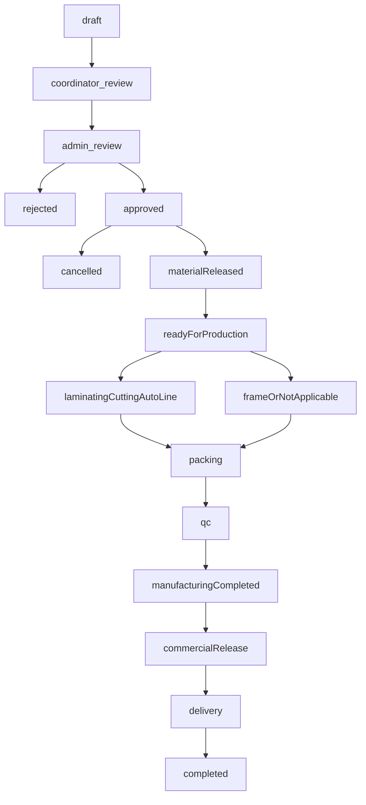

# Sindean Factory Implementation Plan

Status: planning only. This file does not authorize code, schema, or data changes by itself.  
Date: 4 October 2026.  
Authority: `docs/SINDEAN_FACTORY_DOMAIN_SPEC.md`. Domain rules are closed. OPEN-01 and OPEN-03 through OPEN-26 are decided. OPEN-11 and OPEN-13 are decided boundaries with deferred portal and ZATCA work. Section G of the domain spec is configuration and master data, not an open domain rule.

This plan maps that specification onto the current repository. It does not implement it.

## 1. Executive summary

The factory process will stay in this Express, tRPC, Drizzle, and MySQL application. `door_orders` becomes the canonical commercial object. Critical events become relational rows. The server enforces orthogonal states for commerce, advance satisfaction, materials, teams, QC, and delivery.

Change Requests and Cancellation Requests are side workflows. They are not values of the commercial status. Advance satisfaction is derived from payment records and is not a material state. Material Release runs only when the order is Admin Approved, the advance is satisfied, and materials are fully reserved. It is one locked transaction. Frame & Architrave Not Applicable is derived from the effective BOM Snapshot.

Authoritative money uses integer minor units. Authoritative quantities use `DECIMAL` or an integer base unit per UOM. They do not use `FLOAT` or `DOUBLE`.

Production schema changes use versioned SQL migrations. `pnpm db:push` is not the production migration path. The uncommitted `work_orders.order_id` `NOT NULL` foreign key must not be applied until existing rows are inspected and backfilled.

The first coding batch only closes anonymous sensitive mutations. It does not build the factory workflow and it does not push schema.

## 2. Current repository baseline

Inspected on 4 October 2026 from the working tree. `pnpm check`, the test suite, and the build were not re-run in this planning pass. An earlier audit reported `pnpm check` passing, 215 tests passing, and the build passing. Those tests are unit tests. They do not open MySQL.

### Git working tree

Do not reset, overwrite, or discard this work.

Modified:

- `client/src/components/admin/CreateWorkOrderWizard.tsx`
- `client/src/components/admin/WorkOrderModal.tsx`
- `client/src/pages/admin/AdminRFQDetail.tsx`
- `client/src/pages/admin/AdminWorkOrders.tsx`
- `client/src/pages/admin/AdminWorkflow.tsx`
- `drizzle/schema.ts`
- `server/distributors-admin.router.ts`
- `server/inventory.router.ts`
- `server/workOrders.router.ts`
- `task.md`

Untracked: `docs/` (domain specification, gap analysis, readiness checklist, domain learnings, customer PDF, and this plan).

Recent commits are product-option, customer-portal, and VAT fixes. They are not the factory workflow.

The schema diff adds `work_orders.order_id` as `notNull()` with `references(() => doorOrders.id, { onDelete: "cascade" })` and `order_id_idx`. `server/workOrders.router.ts` requires `orderId` on create and its seed looks up or creates a door order. There is no SQL migration for this column. `drizzle.config.ts` sets `out` to `./drizzle/migrations`, and that folder has no migration files. Schema evolution today is `pnpm db:push`.

Applying the current Drizzle definition with a push would add a `NOT NULL` foreign key to existing `work_orders` rows that have no `order_id`. That is unsafe. Keep the uncommitted code. Do not push it.

### Stack and auth

- Runtime: Node, Express, tRPC 11, Drizzle 0.45, `mysql2`, Vitest, Vite, React 19.
- Staff gate: `adminProcedure` in `server/trpc.ts` validates one shared `adminSession` cookie or `x-admin-token` via `server/admin-sessions.ts`. Login accepts `ADMIN_PASSWORD_HASH` or `ADMIN_INTERNAL_KEY`.
- Customers, distributors, and suppliers have their own session tables and cookies. There is no staff user, role, or team-role table.
- `userProcedure` exists for customer sessions. Factory staff procedures do not use it.

### Behaviors that conflict with the domain

- `orders.create` in `server/routers.ts` is `publicProcedure`. The client may send `totalPrice`.
- `orders.updateStatus` writes any of `new`, `reviewing`, `confirmed`, `in_production`, `ready`, `delivered`, `cancelled` with no transition check. On `confirmed` it calls `createInvoiceFromOrder` and ignores failure.
- `server/orders.test.ts` defines a local `STATUS_TRANSITIONS` map and asserts that map. The mutation does not import or enforce it.
- `door_orders.status` and `workflow_stage` (15-stage board, default `po_review`) are independent.
- Inventory has `current_qty` only. `addTransaction` clamps with `Math.max(0, newQty)`. `consumeForWorkOrder` posts `min(requested, on hand)` and still returns success. `CreateWorkOrderWizard` also deducts `client/src/stores/inventoryStore.ts` in `localStorage`.
- `inventory_items.unit_cost`, `bom.total_cost`, and `work_orders.total_value` are `float`. Door `total_price` is an integer, but it is client-supplied.
- `bom` / `bom_items` / `bom_history` are a product cost list with a version integer. They are not a rule engine and they do not snapshot an order.
- Production departments in `server/production.router.ts` are `door_line`, `frame_line`, and `accessories`. Team progress is `work_orders.dept_tasks` JSON and `progress_percent`.
- QC types in `server/qc.router.ts` are `incoming`, `final`, and `po_matching`.
- `packing.closeAccounting` sets `paid_amount` equal to `total_value`.
- Payments that exist are `distributor_payments` plus `door_orders.payment_status`.
- `decision_log` stores a decision enum, a reason, and a typed name. It has no before/after payload and is not written by approval.
- `customerPortal.trackOrder` is public by phone or email and returns `totalPrice`, `paymentStatus`, and `workflowStage`. Complaint image inserts store `images: []`.
- `POST /api/upload` in `server/index.ts` checks image type and size and does not check a session.
- `server/rfq.router.ts` public mutations are `create`, `update`, `sendInvitations`, `evaluateWithAI`, `award`, `updatePOStatus`, and `updateQuoteStatus`. Public reads `list`, `getById`, and `listPurchaseOrders` return RFQ rows, quotes, prices, invitations, and supplier records. `submitQuote`, `respondToInvitation`, and `markInvitationViewed` already use `supplierProcedure`.
- WhatsApp in the admin UI is a `wa.me` link. `server/email.ts` skips silently when SMTP is unset. Forge owner alerts are optional `BUILT_IN_FORGE_API_*` HTTP calls in `server/routers.ts` and several other routers. ZATCA code in `server/zatca.service.ts` can build unsigned XML and post when credentials exist. It is not a production e-invoice system.

## 3. Target architecture

One MySQL database remains the ledger. The browser displays server state. `localStorage` is not stock or money.

`door_orders` stays the canonical commercial row. A unique public order number is added. Distributor orders are not a second commercial truth. New child tables hold quotations, doors, prices, payments, reservations, movements, issues, team events, QC, rework, deliveries, side workflows, notifications, external invoice references, and audit.

Domain code emits business events. It does not call a WhatsApp vendor. The Notification Service subscribes later. A provider failure does not roll back a domain transaction.

Official tax invoices stay in the external accounting system for the first go-live. This application stores references only. ZATCA code stays unused by the factory path.

Change Request and Cancellation Request are not nodes in that chain. An approved order may own a pending request of either kind while its commercial status stays `approved` until a cancellation is approved, or stay `approved` after a change is applied.

## 4. Domain-to-code mapping

Legend: **Now** is what exists. **Reuse** can be kept or adapted. **Change** must be altered. **Deprecate** must leave the factory path. **New** does not exist. Authorization and audit apply to every mutation below. Tests are named in section 13.

### A. Identity and authorization

- Now: shared admin cookie; separate customer, distributor, and supplier sessions.
- Reuse: httpOnly cookie pattern, `userProcedure` session lookup, bcrypt.
- Change: `adminProcedure` becomes a transitional admin role, then permission checks by staff user.
- Deprecate: shared `ADMIN_PASSWORD_HASH` as the only staff identity.
- New: `staff_users`, `staff_roles`, `staff_user_roles`, `staff_sessions`. Optional later `staff_credentials` for PIN or badge.
- Server: login, disable, assign roles, assign team roles.
- UI: staff login. Factory PIN screen is later, on the same user.
- Audit: user created, disabled, role changed, team assignment changed.

### B. Canonical order

- Now: `door_orders` plus `distributor_orders`, linked by `DIST_ORDER_ID:` in notes.
- Reuse: `door_orders` row, `priority` urgent flag, notes.
- Change: add `canonical_number`, owner, commercial status. Stop arbitrary `updateStatus`.
- Deprecate: 15-stage `workflow_stage` as the floor state. Notes prefix as a foreign key.
- New: commercial status column. Do not add a second order header.
- UI: coordinator queue, admin review, sales-person own-order list.

### C. Quotation revisions

- Now: none. The word exists only in the domain spec. Supplier RFQ is unrelated.
- New: `quotation_revisions` on the same canonical number. Versions are insert-only. The accepted revision id is stored on the order.
- Server: create revision, accept revision, direct-order path with no revision.
- UI: revision history. No overwrite.

### D. Door identity

- Now: door JSON on `door_orders.dimensions` and `work_orders.doors`.
- Reuse: size, direction, and hardware fields as the source to backfill.
- New: `order_doors` with stable id, customer door number, measurements.
- Unique: `(order_id, door_number)` and the stable id.
- UI: door list, cutting sticker, packing label.

### E. Pricing and price book

- Now: client `total_price` and `base_price`. Product options live in `product_options` and partly in browser storage.
- Change: server calculates the total. Ignore browser totals for the ledger.
- New: `price_books`, `price_rules`. Integer minor units.
- Deprecate: treating `product_options` local totals as commercial truth.

### F. Payments and advance

- Now: `payment_status` enum and `distributor_payments`. `packing.closeAccounting` forces paid.
- Reuse: the idea of a payment row from `distributor_payments`, not that table as the factory ledger.
- New: `payments` with status confirmed, rejected, or voided. Advance requirement is a configured minor-unit amount or percent stored on the accepted commercial total. Advance Satisfied is computed.
- Deprecate: manual `payment_status` and `paid_amount = total_value`.

### G. BOM versions

- Now: `bom`, `bom_items`, `bom_history` as a product cost sheet. Waste is a single float percent.
- Reuse: version and draft/active/archived as a hint, not as the rule engine.
- New: `bom_rule_sets` and `bom_rules` with rule kind (fixed per door, linear, area, conditional, fixed per order, manual component, waste factor), UOM, and published-by admin.
- Deprecate: hardcoded multipliers. Do not put factory formulas in TypeScript.

### H. BOM Snapshot

- Now: none.
- New: immutable `bom_snapshots` and `bom_snapshot_lines` copied at commitment. Reservation, Material Release, and Material Issue read the snapshot only.
- Overrides: separate rows with reason, authorizer, and audit. They do not edit the published rule set.

### I. Inventory quantities

- Now: `inventory_items.current_qty` int. Movements in `inventory_transactions` with before/after. No reserved quantity. Clamp and partial consume exist. Browser copy exists.
- Reuse: movement row shape (`balance_before`, `balance_after`, type).
- Change: stop clamp and partial success. Split receipt, issue, and adjustment. Quantity column becomes `DECIMAL` or an integer base unit per item UOM. `unit_cost` float is not authoritative money.
- New: `reserved_qty` maintained only by reservation transactions, plus `reservation_lines` and `shortage_lines`. Available is On Hand minus Reserved, computed in the locked transaction, not trusted from the client.
- Deprecate: `inventoryStore.ts` deduction and hardcoded "متوفر" UI.

### J. Material Release

- Now: absent. Approval and `confirmed` do not deduct. Work-order create triggers browser and optional server consume.
- New: one command, `material_releases`, idempotency key, unique per order.
- Preconditions: commercial `approved`, Advance Satisfied, material `fully_reserved`.
- Effects: consume reservations, deduct On Hand, movements, Material Issue, material state `released`, audit.

### K. Material Issue

- Now: none.
- New: `material_issues` and `material_issue_lines` from the snapshot. Original rows are not updated or deleted.

### L. Production routing

- Now: `dept_tasks` JSON and a 15-stage board.
- New: `team_assignments` per order and team: `upcoming`, `ready`, `in_progress`, `completed`, `not_applicable`.
- Server: Start only from `ready`. Dependencies: Laminating then Cutting then Auto Line. Frame & Architrave does not wait on that path.

### M. Five team queues

- Now: wrong department ids. No team login.
- New: queues filtered by the caller's team roles. Upcoming is visible. Start is disabled until `ready`.
- UI: five iPad queues, urgent in red. Shared device, individual user.

### N. Frame & Architrave Not Applicable

- Now: none.
- New: when the snapshot has no frame or architrave components or manufacturing work, the server sets that team row to `not_applicable` and audits it.
- Packing `ready` when Auto Line is `completed` and Frame & Architrave is `completed` or `not_applicable`.
- No team procedure can set `not_applicable`. A later BOM change recalculates it only when a Change Request is approved.

### O. Packing

- Now: `packing_orders` status flags and a `doors` JSON packed flag.
- Reuse: packing as a stage name only.
- New: packing is the Packing team assignment plus a label print from `order_doors`. Template is configuration.
- Deprecate: `closeAccounting` as payment.

### P. QC

- Now: `qc_inspections` with incoming, final, and PO matching.
- Reuse: an inspection row only after it is redefined.
- New: Production Manager pass/fail at Packing. Fail creates one rework ticket. Pass sets QC passed. Customer manufacturing-completed is derived after pass.
- Deprecate: incoming QC and a QC department queue as required gates.

### Q. Rework

- Now: fail does not assign a team.
- New: `rework_tickets` to one team, with reason. That team works it. The manager inspects again with the same QC action.

### R. Rework material

- Now: none.
- New: Production Manager records the need. Stock Manager posts `rework_material_issues` and `rework_material_returns`. These do not update the original Material Issue. Unavailable material sets the rework to waiting. Same no-negative and lock rules as other stock movements.

### S. Commercial Release

- Now: not stored.
- New: `commercial_releases`. The coordinator insert is rejected unless QC is passed and the calculated balance is fully paid. The server computes the enablement. The coordinator still performs the action.

### T. Partial delivery by Door ID

- Now: packing delivery status only.
- New: `deliveries` and `delivery_doors`. Quantity is the count of door ids. Unique `(door_id)` among active deliveries. States: ready, partial, completed when every required door is delivered.
- Delivery is rejected before QC passed, fully paid, and commercial release.

### U. Cancellation

- Now: `orders.updateStatus` to `cancelled`, and work-order cancel with a typed name. No stock effect.
- New: `cancellation_requests` with request, admin decision, reason. Commercial status becomes `cancelled` only when Admin approves. Sales may request. Production Manager may add a production note and cannot approve.

### V. Material reconciliation

- Now: none.
- New: before Material Release, approval releases reservation rows only. After release, `cancellation_reconciliations` record returned, consumed, damaged, or a later configured category. Returns are new reversing movements. The original issue stays.

### W. Refunds

- Now: none on factory orders.
- New: `refunds` with request, approve, reject, execute. Admin approves. Original `payments` rows are not updated or deleted. No automatic refund from cancellation. No penalty percent.

### X. Customer tracking

- Now: public `trackOrder`, email match on `myOrders`, mock pages, self-registration, public order create.
- Change: customer accounts are created by Admin or Sales Coordinator. History is by `user_id`. Status is derived. No raw workflow, quantities, names, or defect text.
- Deprecate: phone-or-email tracking.

### Y. Notification Service

- Now: `wa.me`, silent SMTP, Forge HTTP, `summary_recipients.channels` including whatsapp with no sender.
- New: `notifications` and `notification_rules`. Channels: in-app, WhatsApp, email. Domain transactions commit first. Send and retry are outside that transaction. First customer event is QC Passed, without claiming delivery is available.
- Deprecate: Forge owner alerts and manual `wa.me` as the factory send.

### Z. Audit log

- Now: `decision_log` and inventory before/after on some movements.
- New: `audit_events`. Do not widen `decision_log` into this log.
- Deprecate: `decision_log` as the factory audit. Keep the table until a later removal.

### AA. External invoice references

- Now: `tax_invoices` created from `confirmed`, unsigned ZATCA XML.
- Change: remove the factory call from `updateStatus`. Do not delete `server/zatca.service.ts`.
- New: `external_invoice_refs` for number, date, and external status. Not clearance.

## 5. Proposed state model

Do not reuse `door_orders.status` or `workflow_stage` as the factory machine. Those strings can remain readable during migration. New columns are the authority.

### Commercial status

`draft`, `coordinator_review`, `admin_review`, `approved`, `rejected`, `cancelled`.

A sales-person draft goes to `coordinator_review`, then `admin_review`. A coordinator-created draft may go straight to `admin_review`. Admin sets `approved` or `rejected`. `rejected` stores a reason. `cancelled` is set only by an approved Cancellation Request.

### Side workflows

`change_requests.status`: `requested`, `approved`, `rejected`, `applied`.

`cancellation_requests.status`: `requested`, `approved`, `rejected`.

An order in `approved` may have one open change request and, separately, one open cancellation request. Applying a change does not by itself change commercial status. Approving cancellation sets commercial status to `cancelled`.

### Advance

Not stored as an order status. `advance_required_minor` comes from the accepted commercial total and the configured policy. `advance_satisfied` is true when confirmed payments, minus executed refunds when those exist, cover that required amount. The UI may say Approved – Awaiting Advance when commercial status is `approved` and this flag is false.

### Material state

`not_started`, `pending_materials`, `partially_reserved`, `fully_reserved`, `released`.

Reservation does not start until commercial status is `approved` and advance is satisfied. Until both are true, material state stays `not_started`. After that, no reserved quantity is `pending_materials`, a partial allocation is `partially_reserved` with shortage rows, and every required line reserved is `fully_reserved`. Material Release sets `released`. Awaiting Advance is never a material-state value.

Material Release requires all of:

- commercial status `approved`
- advance satisfied
- material state `fully_reserved`

### Team state

For each of Laminating, Cutting, Auto Line, Frame & Architrave, and Packing: `upcoming`, `ready`, `in_progress`, `completed`. Frame & Architrave may instead be `not_applicable`, set only by the server from the snapshot.

Start is allowed only from `ready` and only for a user who holds that team role. Complete moves that team to `completed`.

Packing becomes `ready` only when Auto Line is `completed` and Frame & Architrave is `completed` or `not_applicable`.

### QC, payment, delivery

- QC: `not_ready`, `pending`, `rework`, `passed`.
- Payment: no stored Fully Paid flag. Fully Paid is Accepted Final Total minus confirmed payments, net of executed refunds, in minor units.
- Delivery: `not_ready`, `ready_for_delivery`, `partially_delivered`, `completed`.

Manufacturing completed is derived when QC is `passed` and required teams are `completed` or `not_applicable`. Commercial Release is a row, not a substitute for QC or payment.

## 6. Proposed data model

New business tables are relational. JSON remains only for measurement detail blobs, label-template configuration, notification template parameters, and audit before/after payloads. `dept_tasks` and `workflow_stages_data` are not extended.

Money columns are `BIGINT` minor units. Quantity columns are `DECIMAL(p,s)` or `BIGINT` base units. The item row records `quantity_storage` as `decimal` or `base_unit`, plus scale. Do not add authoritative `FLOAT` or `DOUBLE`.

| Proposed structure | Purpose | Current equivalent | Migration risk | Backfill | Nullability | Uniqueness and links |
| --- | --- | --- | --- | --- | --- | --- |
| `staff_users`, roles, sessions | Individual staff | `admin_sessions` | Low if added beside the cookie | None | Email unique, password required | Session token unique |
| `door_orders.canonical_number`, `commercial_status`, `owner_staff_id`, `material_state` | Canonical order | `door_orders.status` | Medium on existing rows | Generate numbers from id. Map old status only as a legacy label | Number unique and not null after backfill | Owner FK nullable until staff exist |
| `quotation_revisions` | Versioned quotation | None | Low | None | Revision number not null | Unique `(order_id, revision_no)` |
| `order_doors` | Stable door identity | JSON dimensions and `work_orders.doors` | Medium | Parse JSON where the shape is known. Leave unparsed rows for review | Door number not null | Unique `(order_id, door_number)` |
| `price_books`, `price_rules` | Server prices | Client integers | Low | Do not invent prices | Amount not null | Book code unique |
| `payments`, `refunds` | Ledger | `payment_status`, distributor payments | Medium | Do not convert flags into fake payments | Amount minor not null | Idempotency key unique |
| `bom_rule_sets`, `bom_rules` | Versioned formulas | `bom`, `bom_items` | Low | Do not copy guessed multipliers | Published version immutable | Unique `(set_id, version)` |
| `bom_snapshots`, lines | Order freeze | None | Low | Created forward only | Quantities not null | Unique per order while current |
| `inventory_items` quantity and `reserved_qty` | On Hand and Reserved | `current_qty` int | High | Copy `current_qty` into the new quantity column. Reserved starts at 0 | Not null after copy | Item code unique |
| `inventory_transactions` extended | Movements | Same table | Medium | Keep historical rows. New rows use the new quantity type | Before and after not null | Index `(item_id, created_at)` |
| `reservation_lines`, `shortage_lines` | Allocation | None | Low | None | Quantity not null | Index `(order_id)`, `(item_id)` |
| `material_releases`, `material_issues`, lines | Commitment | None | Low | None | One release per order | Unique `order_id`, unique idempotency key |
| `team_assignments` | Queues | `dept_tasks` JSON | Medium | Do not trust JSON as history | State not null | Unique `(order_id, team)` |
| `rework_tickets`, rework material docs | QC fail | `qc_inspections` | Low | Do not migrate incoming QC into factory QC | Team not null | FK to order and door set |
| `commercial_releases` | Coordinator release | None | Low | None | One per order | Unique `order_id` |
| `deliveries`, `delivery_doors` | Partial delivery | Packing flags | Low | None | Door id not null | Unique active `door_id` |
| `change_requests`, `cancellation_requests`, reconciliations | Side workflows | Work-order cancel text | Low | None | Reason not null | Open-request unique per order where required |
| `audit_events` | Append-only audit | `decision_log` | Low | Do not backfill a fake history | Actor and timestamp not null | Index `(order_id, id)` |
| `notifications` | Outbound record | None | Low | None | Status not null | Unique `(event_id, channel, recipient)` |
| `external_invoice_refs` | Accounting pointer | `tax_invoices` | Low | Do not treat local invoices as official | External number not null when present | Index `order_id` |

`work_orders` may remain as a legacy document during migration. New team state does not live in `dept_tasks`. See section 10 for `order_id`.

Rollback of a new empty table is a forward drop before it is used. Rollback of a quantity type change is a forward fix, not a blind column drop, once movements exist.

## 7. Authorization model

Permissions are checked in tRPC middleware from the session. UI hiding is not the control.

Roles: Admin, Sales Coordinator, Sales Person, Stock Manager, Production Manager, Laminating, Cutting, Auto Line, Frame & Architrave, Packing, Customer.

A staff user has one or more roles. Production workers have team roles. One person may hold several team roles. Disabling the user blocks new sessions and does not rewrite audit actor ids.

Session: httpOnly cookie, server-side row, expiry, inactivity lock later. The session stores `staff_user_id`. It does not store a team password. PIN, badge, or QR later authenticates that same user. NFC is a later credential type. A Cutting user at a Laminating device still fails Laminating Start.

Sales Person list and mutate filters `owner_staff_id = session.user`. Customer list filters `customer_user_id = session.user`. Phone or email is not authentication.

The domain matrix in the specification is the permission list. In particular, only the server may reserve, release materials, and set Not Applicable. Only Admin approves cancellation, refunds, change requests, BOM publication, and reservation priority overrides. Only the Stock Manager posts receipts, issues, adjustments, reconciliation, and rework material movements. Only the Production Manager records QC and delivery. Only the Sales Coordinator issues Commercial Release, and only when the server enables it.

Until staff roles exist, phase 1 keeps `adminProcedure` on the formerly public factory and RFQ mutations, including `orders.create`. A customer session is not accepted for order create. `trackOrder` is disabled rather than left on a customer session. That lockdown is not the target Sales Coordinator or Sales Person model.

## 8. Transaction boundaries

A transaction is necessary but not sufficient. Stock and reservation commands take row locks and then re-read.

MySQL InnoDB, `REPEATABLE READ`. Lock inventory rows with `SELECT ... FOR UPDATE` in a stable item-id order to avoid deadlocks. Lock the order row the same way. Conditional updates use `WHERE on_hand = expected` or `WHERE on_hand >= qty`, and the statement must affect one row or the transaction rolls back. Do not clamp.

| Command | Locks and rules | Idempotency |
| --- | --- | --- |
| Reservation allocation | Lock item rows. Available = On Hand − Reserved. Insert reservation lines only for a quantity that still fits. Shortage rows for the rest. Two orders cannot reserve more than On Hand. | One open allocation generation per order. Retry returns the same lines. |
| Reallocation | Lock affected orders by id order, then items. Physical adjustment posts first. Then shortage resolution by commitment priority. | Reallocation batch id unique |
| Material Release | Lock order and items. Re-check approved, advance satisfied, and `fully_reserved`. Consume reservations, deduct On Hand, write movements and Material Issue, set `released`, audit. | Unique `material_releases.order_id` and idempotency key |
| Stock adjustment | Lock item. Movement with before, delta, after, reason. Fail if after would be negative. If a configured threshold is exceeded, require a prior Admin approval row. | Idempotency key |
| Rework Material Issue | Same item lock and conditional deduct. Separate document. Waiting state if unavailable. No negative On Hand. | Unique issue key |
| Cancellation reconciliation | Lock order, reservations, and items. Before release: delete or close reservations only. After release: insert return movements for returned quantities. Do not update the original issue. | One reconciliation per approved cancellation |
| Payment confirm or void | Lock the order's payment set. Insert or mark the payment. Recompute the derived balance in the same transaction. Do not set a Fully Paid column. | Provider or manual reference unique |
| Refund execute | Lock payments. Insert refund. Do not update the payment amount. | Unique refund idempotency key |
| Delivery | Lock order and door rows. Reject a door that already has an active delivery. Insert delivery and door links. Derive partial or completed. | Unique `door_id` on active delivery lines |
| Change Request apply | Lock order and snapshot. Write a new snapshot if the BOM changes. Recalculate reservations if not yet released. Recalculate Not Applicable. Audit before and after. | Unique applied request id |
| QC fail or pass | Lock order and team rows. Insert inspection and, on fail, one rework ticket. Commit domain state even if notification later fails. | Inspection event id unique |

`orders.updateStatus` today is not a transaction and must not remain the factory command.

## 9. Audit architecture

New table `audit_events`. Append-only. No update or delete API.

Columns:

- `id` bigint
- `event_type` stable dotted name, such as `inventory.material_release`
- `entity_type`, `entity_id`
- `canonical_number` nullable only when the entity is not yet an order
- `actor_id` staff or customer id, retained after disable
- `actor_role`
- `actor_kind` `USER` or `SYSTEM` (`TEAM` is the user's team role, not a shared login)
- `occurred_at` server time
- `before_json`, `after_json`
- `reason` nullable except where the domain requires it
- `correlation_id` from the request
- `idempotency_key` nullable

The application role used by the API must not have `UPDATE` or `DELETE` on this table. Corrections are new events.

Do not log screen views here. Access logs stay separate. `decision_log` is not this table.

Cover the mutation list in domain spec section 13, plus the derived Not Applicable routing decision.

## 10. Migration and backfill strategy

`pnpm db:push` is not the production mechanism. Phase 0 creates a real migration history before any later phase alters production tables.

Phase 0 work:

1. Read the live schema with `information_schema` and diff it against `drizzle/schema.ts`. Record drift, especially whether `work_orders.order_id` already exists.
2. Take a logical backup before the first migration. Record how to restore it.
3. Baseline: generate a snapshot migration that matches the database that is actually deployed, not the unpushed Drizzle file. Check that snapshot in.
4. Rehearse every later migration on a copy or staging database.
5. Risky columns use nullable add, backfill, verify, then `NOT NULL` or foreign key.
6. Prefer a forward fix when a migration has been applied. Keep a down script only when it cannot destroy rows.
7. After a restore drill, confirm row counts for `door_orders`, `work_orders`, and `inventory_items`.

### `work_orders.order_id`

The working tree already declares this column `NOT NULL` with `ON DELETE CASCADE` and the router requires it. That definition must not be pushed as-is.

Safe sequence:

1. If the live table has no `order_id`, add it nullable, indexed, with no foreign key.
2. Backfill where a reliable link exists. The notes prefix `DIST_ORDER_ID:` is not a reliable work-order link. Do not invent matches.
3. Report orphans: work orders with null `order_id`.
4. Leave them nullable, or attach them only with an explicit reviewed mapping.
5. Add the foreign key and `NOT NULL` only when the orphan count is zero.
6. Do not use `ON DELETE CASCADE` for factory orders. Cancelling or deleting an order must not silently delete manufacturing history. Use `RESTRICT`.

If the live database already has the column as `NOT NULL` because someone pushed the working tree, stop and inventory the rows before any further constraint change.

Existing `current_qty` is copied into the new quantity column at scale 0. Reserved starts at 0. Historical movements stay. New movements use the new type. Do not rewrite old balances to look like reservations.

## 11. Implementation phases

Each phase ends with `pnpm check`, targeted tests, and `pnpm build:local` when client or server bundles change. None of these phases is production-ready by itself.

### Phase 0 — Repository baseline and migration safety

- Objective: know the live schema, establish versioned migrations, and protect `work_orders.order_id`.
- Code: `drizzle.config.ts`, new `drizzle/migrations`, a short operator note in this plan's phase record only if needed. No factory features.
- Schema: baseline snapshot only. Do not apply the uncommitted `NOT NULL` foreign key.
- Server and client: none.
- Tests: migration applies on an empty database and on a copy of a backup.
- Backfill: inventory of orphans, no silent update.
- Dependencies: a `DATABASE_URL` for a non-production copy.
- Done: reviewed SQL files exist. `db:push` is documented as disallowed for production.
- Not included: security fixes, roles, or workflow.

### Phase 1 — Security lockdown

- Objective: close anonymous sensitive mutations. This batch does not add roles and does not change schema.
- Code: `server/routers.ts` `orders.create`, `server/rfq.router.ts` public RFQ and purchase-order procedures listed below, `server/index.ts` `POST /api/upload`, `server/customer-portal.router.ts` `trackOrder`.
- Schema: none. Do not run `db:push`.
- Server:
  - `orders.create` requires the existing `adminProcedure` gate only. An anonymous caller and an authenticated customer session are both unauthorized. This is a temporary lockdown. It does not make Admin the permanent order-entry role. Phases 2 and 3 replace this gate with Sales Coordinator and Sales Person authorization.
  - Temporarily require `adminProcedure` for every public RFQ or purchase-order mutation: `create`, `update`, `sendInvitations`, `evaluateWithAI`, `award`, `updatePOStatus`, and `updateQuoteStatus`. Also require it for the public reads `list`, `getById`, and `listPurchaseOrders`, because they return quotes, prices, invitations, and supplier records and are not a product catalog. Leave `submitQuote`, `respondToInvitation`, and `markInvitationViewed` on `supplierProcedure`. Do not redesign the supplier or RFQ portal.
  - `POST /api/upload` rejects callers with no admin session. Keep the existing MIME and size checks.
  - Unauthenticated `trackOrder` returns `UNAUTHORIZED` and no order payload. Phone or email is not authentication. Do not keep a reduced anonymous response. `door_orders` has no customer `user_id`, so an authenticated customer path cannot be guaranteed. Disable `trackOrder` until Phase 16.
  - Public product-catalog reads that expose no order, quote, price, or supplier data may stay public.
- Client: only if a screen breaks because it called a newly closed procedure. Do not redesign the portals.
- Tests: anonymous `orders.create` fails; authenticated customer `orders.create` fails; temporary admin `orders.create` succeeds; anonymous RFQ `create`, `update`, `sendInvitations`, `evaluateWithAI`, `award`, `updateQuoteStatus`, and `updatePOStatus` fail; anonymous upload fails; anonymous `trackOrder` fails and returns no order data.
- Dependencies: phase 0 is not required to close procedures. Do not block this phase on a migration baseline if no schema change is included.
- Done: the listed anonymous writes, sensitive RFQ reads, and `trackOrder` are closed to anonymous and customer callers as specified.
- Not included: new roles, factory workflow, inventory, pricing, ZATCA, or deleting RFQ and ZATCA files.

### Phase 2 — Identity and authorization

- Objective: individual staff users and roles.
- Code: `server/trpc.ts`, `server/admin.router.ts`, `server/admin-sessions.ts`, new staff router.
- Schema: staff tables. Versioned migration.
- Server: login, disable, role assignment, team-role assignment, permission middleware.
- Client: staff login. Keep the admin cookie only until call sites move.
- Tests: role denial, disabled user, sales ownership filter once orders have owners.
- Dependencies: phase 1.
- Done: a named user can hold Admin and a team role. A team role cannot call another team's Start.
- Not included: PIN hardware, NFC, and the full order machine.

### Phase 3 — Canonical order and door identity

- Objective: one public number and stable doors.
- Code: `server/routers.ts`, order admin pages, wizard only as a reader of server doors.
- Schema: canonical number, commercial status, `order_doors`.
- Server: create draft, submit, coordinator review, admin approve or reject with reason. No stock effect.
- Client: replace free status jumps on the factory path.
- Tests: illegal transitions fail. Customer cannot create. Sales sees only own orders.
- Backfill: numbers for existing rows. Door JSON parsed only when valid.
- Dependencies: phase 2.
- Not included: prices as the ledger, reservation, team queues.

### Phase 4 — Audit foundation

- Objective: append-only audit before later commands rely on it.
- Code: new audit helper used by later phases. `decision_log` left in place.
- Schema: `audit_events` plus a DB user grant that cannot update or delete it, documented for deployment.
- Server: helper writes actor from the session.
- Tests: a sample mutation writes before and after. A second call does not update the first row.
- Dependencies: phase 2. Order number from phase 3 when the entity is an order.
- Not included: auditing every historical row.

### Phase 5 — Quotation, pricing, payments, and advance

- Objective: server totals, revisions, payment rows, derived advance.
- Code: new pricing and payment routers. Stop trusting client `totalPrice` on the factory path.
- Schema: price book, rules, revisions, payments. Minor units.
- Server: accept revision, record and confirm payment, compute balance and advance satisfied.
- Client: show server totals. Do not post browser totals as truth.
- Tests: Fully Paid is computed. A manual paid flag is rejected. Advance is not required to approve.
- Dependencies: phases 3 and 4.
- Not included: the factory's real price list. That is configuration. Material Release.

### Phase 6 — Inventory ledger

- Objective: On Hand movements without clamp, with per-UOM precision.
- Code: `server/inventory.router.ts`, `inventoryStore.ts` call sites.
- Schema: quantity type, movement kinds, no negative check in the conditional update.
- Server: receipt, issue, and adjustment as distinct commands. Remove `Math.max(0, …)` and partial consume success.
- Client: stop writing stock to `localStorage`.
- Tests: a short deduction rolls back. Adjustment stores before, delta, and after.
- Dependencies: phases 2 and 4. Staff Stock Manager from phase 2.
- Not included: reservation and Material Release.

### Phase 7 — BOM versions and snapshot

- Objective: published rules and an immutable snapshot.
- Code: `server/bom.router.ts` kept for the old cost sheet until the new engine replaces factory use.
- Schema: rule sets, rules, snapshots.
- Server: Admin publishes. Snapshot is copied onto the order. Not Applicable can be computed from it.
- Tests: snapshot does not change when the published rule changes. No TypeScript hinge constant.
- Dependencies: phases 3 and 6 for items and UOM.
- Not included: guessed Sindean formulas.

### Phase 8 — Reservations and shortages

- Objective: allocate without oversell.
- Schema: `reservation_lines`, `shortage_lines`, `reserved_qty`.
- Server: start only after approved and advance satisfied. Partial reservation. Priority by earlier commitment. Admin override audited.
- Tests: the concurrent two-order test in section 13. Shortage does not make On Hand negative.
- Dependencies: phases 5, 6, and 7.
- Not included: Material Release.

### Phase 9 — Material Release and Material Issue

- Objective: the atomic commitment.
- Server: the locked command in section 8. Edit lock for sales after success.
- Client: no release button that bypasses preconditions. Stock Manager reads the issue. No handoff button.
- Tests: repeated release does not deduct twice. Missing advance or partial reservation rejects the command.
- Dependencies: phase 8.
- Not included: team Start.

### Phase 10 — Production routing and queues

- Objective: five teams and dependencies, including Not Applicable.
- Code: `server/production.router.ts`, `server/workOrders.router.ts` progress JSON, work-order UI.
- Schema: `team_assignments`.
- Server: Upcoming, Ready, Start, Complete. Packing gate. Not Applicable from the snapshot only.
- Client: five queues. Urgent in red. Device does not grant a role.
- Tests: Cutting Start before Laminating Complete fails. Packing waits. An order with no frame snapshot is Not Applicable and Packing can become ready after Auto Line. A worker cannot post Not Applicable.
- Dependencies: phases 2, 7, and 9.
- Not included: using `dept_tasks` as the new machine.

### Phase 11 — Packing, QC, and rework

- Objective: label, QC, rework ticket, rework material.
- Code: `server/qc.router.ts`, `server/packing.router.ts`.
- Schema: inspections redefined, rework tickets, rework material documents, label template config.
- Server: fail names one team. Pass is explicit. Rework issue uses the stock locks.
- Client: Production Manager QC. Packing label without customer contact data by default.
- Tests: fail then rework then pass. Missing rework material waits. QC commit does not depend on WhatsApp.
- Dependencies: phases 6 and 10.
- Not included: Commercial Release.

### Phase 12 — Commercial Release

- Objective: coordinator release only when QC passed and Fully Paid.
- Schema: `commercial_releases`.
- Server: enablement query and insert.
- Tests: release before QC fails. Release before Fully Paid fails. Payment after QC then succeeds.
- Dependencies: phases 5 and 11.
- Not included: delivery.

### Phase 13 — Delivery

- Objective: partial delivery by door id.
- Schema: `deliveries`, `delivery_doors`.
- Server: derive quantity. Reject a second delivery of the same door. Complete only when all required doors are delivered.
- Tests: two partial deliveries, duplicate door rejected, payment allocation unchanged.
- Dependencies: phases 3 and 12.
- Not included: refunds.

### Phase 14 — Cancellation and reconciliation

- Objective: side-workflow cancellation and stock effects.
- Schema: cancellation requests and reconciliation lines.
- Server: request, admin approve, release reservations before Material Release, reconcile after it.
- Tests: cancel before release restores nothing to On Hand and clears reservations. Cancel after release does not delete the issue. No refund row is created.
- Dependencies: phases 8 and 9.
- Not included: automatic penalties.

### Phase 15 — Refunds

- Objective: independent refund workflow.
- Schema: `refunds`.
- Server: request, admin approve or reject, execute as a new row.
- Tests: original payment unchanged. Sales cannot approve.
- Dependencies: phase 5. Must not be triggered by phase 14.
- Not included: tax credit notes. Those stay external.

### Phase 16 — Customer portal and tracking

- Objective: derived milestones, YES/NO color, complaints with images.
- Code: `server/customer-portal.router.ts`, `server/users.router.ts` self-serve create, customer pages.
- Server: map internal state to the customer milestone list. Color threshold uses Available. No quantities to the customer.
- Tests: customer A cannot read customer B. Rework shows a neutral message. Status is not a free-text staff field.
- Dependencies: phases 2, 6, 8, 10, 11, 12, and 13 for the full milestone set.
- Not included: public phone tracking.

### Phase 17 — Notification Service

- Objective: events, rules, channels, persistence, retry.
- Code: new notification module. Domain routers only emit events. Remove factory dependence on Forge and `wa.me`.
- Schema: `notifications`, rules.
- Server: in-app for staff action. WhatsApp adapter behind an interface. Email optional. Failure does not change QC.
- Tests: duplicate event does not double-send. Adapter throw leaves QC passed.
- Dependencies: phase 11 for the first customer event. Earlier phases may emit events with no sender.
- Not included: choosing the vendor. That is configuration.

### Phase 18 — Dashboards

- Objective: read models for queues, shortages, and releases.
- Code: `server/analytics.router.ts` and admin boards only as readers.
- Server: no writes of stock, Fully Paid, or customer status from a dashboard.
- Dependencies: the phases that own those states.
- Not included: a second ledger.

### Phase 19 — External invoice references

- Objective: store external number, date, and status. Remove invoice-on-`confirmed` from the factory command.
- Code: `server/routers.ts` fire-and-forget call. Leave `server/zatca.service.ts` in the tree, uncalled by approval, QC, release, and delivery.
- Schema: `external_invoice_refs`.
- Tests: confirming or approving an order inserts no `tax_invoices` row.
- Dependencies: phase 3.
- Not included: ZATCA signing or onboarding.

### Phase 20 — Deferred integrations

- Objective: none in the first go-live.
- Later: ZATCA only with compliance work and a defined trigger. Distributor ordering only as an Order Source into `door_orders`. Supplier login stays out of receipts.
- Not included: deleting the current portal or ZATCA files in the first factory batches.

## 12. Implementation batches

Do not implement this plan in one agent run. Each batch is implemented, then `pnpm check`, tests, `pnpm build:local`, review, and commit, before the next batch starts.

1. **Security lockdown.** Phase 1 only. No schema migration and no `db:push`.
2. **Identity.** Phase 2. Admin cookie remains until procedures move.
3. **Order, doors, and audit.** Phases 3 and 4.
4. **Commercial money.** Phase 5. Advance is derived. No material state is added here except leaving it `not_started`.
5. **Stock through Material Release.** Phases 6, 7, 8, and 9. This batch is large and should be split again at phase boundaries if the diff is hard to review. Reservation includes the concurrent test before Material Release is enabled.
6. **Floor.** Phases 10 and 11, including Not Applicable.
7. **Release, delivery, cancellation, refunds.** Phases 12 through 15. Cancellation must not create a refund.
8. **Customer, notifications, dashboards, external references.** Phases 16 through 19.
9. **Deferred portals and ZATCA.** Phase 20, only when explicitly scheduled.

Phase 0 is a human and database task before the first production migration. It is not part of batch 1. Batch 1 must not push schema. The first time a later batch adds a table, phase 0's versioned migration path must already exist on that environment.

## 13. Testing strategy

Current tests do not open the database. `server/orders.test.ts` asserts a transition map that `orders.updateStatus` ignores. That pattern must not be copied. Transition tests call the router or the domain function that the router calls, against MySQL.

Use a disposable MySQL schema per run, or a transaction that rolls back, except for concurrency tests. Concurrency tests need two real connections and must commit.

For each phase, add the layers that the phase can actually fail:

- Unit tests for pure calculations: advance, Fully Paid, Available, packing eligibility, customer milestone mapping, BOM quantity from a fixture rule.
- Database integration tests for inserts, constraints, and locks.
- Authorization tests for each new procedure.
- Rollback tests where a conditional update matches zero rows.
- Idempotency tests for Material Release, payments, and notifications.
- State tests for illegal transitions.
- Router tests for input and error codes.
- UI tests only for a queue enablement or a customer milestone that is easy to get wrong. Do not snapshot the whole admin shell.

High-value scenarios:

1. Draft through coordinator, admin approval, reservation, release, teams, QC pass, full payment, commercial release, and final delivery.
2. Shortage, partial reservation, receipt, then Material Release.
3. Cancellation before Material Release releases reservations and does not change On Hand.
4. Cancellation after Material Release reconciles quantities and leaves the original issue.
5. QC fail, rework, extra material, QC pass.
6. Two partial deliveries of named door ids. The third attempt on a delivered door fails. The order completes only when all doors are delivered.
7. Refund after cancellation. The payment row is unchanged. A refund row exists only because a refund was requested and approved.
8. A Cutting user cannot Laminate, release stock, or approve a refund.
9. A sales person cannot read another sales person's order.
10. A customer cannot read another customer's order or track by phone alone.
11. Two Material Release calls deduct once.
12. Two orders compete for one item. Reserved quantity never exceeds On Hand.
13. A stocktake below current reservations posts the physical adjustment first, then reallocates. Affected orders return to pending materials. On Hand does not go negative.
14. A snapshot with no frame work sets Frame & Architrave to Not Applicable. Packing becomes ready after Auto Line completes.
15. An approved Change Request that adds a frame recalculates the snapshot and clears Not Applicable. A team call cannot do that.
16. Commercial Release is rejected until QC is passed and the computed balance is fully paid.

The concurrent reservation test uses two connections, one item with a known On Hand, and two orders whose combined need exceeds that On Hand. The assertion is `reserved_qty <= on_hand` and the sum of reservation lines for that item equals `reserved_qty`.

## 14. Legacy and deprecation strategy

| Current concept | Class | What happens |
| --- | --- | --- |
| Express, tRPC, MySQL, admin shell | KEEP | Same application |
| httpOnly session cookies | REUSE | Pattern for staff sessions |
| `door_orders` | MIGRATE | Canonical order. Old status strings become legacy labels |
| `inventory_items` and movement before/after | REUSE | Extend. Stop clamp |
| `work_orders.order_id` intent | MIGRATE | Nullable, backfill, then restrict. Not cascade delete |
| Door JSON | MIGRATE | Into `order_doors` where parseable |
| `priority` urgent | REUSE | Red queue flag |
| Upload MIME checks | REUSE | Add a session |
| ZATCA helpers | KEEP | Unused by the factory path until a later compliant project |
| 15-stage board | DEPRECATE | Not the floor machine. Do not delete rows in the first batches |
| `door_line`, `frame_line`, `accessories`, QC department | DEPRECATE | Replace with the five teams |
| `dept_tasks` and `progress_percent` | DEPRECATE | Not the team ledger |
| `inventoryStore.ts` stock writes | DISABLE | Remove from the deduction path |
| Public `orders.create` | DISABLE | Phase 1 |
| `DIST_ORDER_ID:` notes link | DEPRECATE | Not a foreign key |
| Distributor orders and portal | KEEP | Outside the canonical workflow. Redesign later. Do not delete now |
| Supplier and RFQ portal | DISABLE anonymous mutations. KEEP code | Not a factory dependency |
| Company mock login | DEPRECATE | Not a server session |
| `packing.closeAccounting` | DISABLE | Not Fully Paid |
| `payment_status` as the ledger | DEPRECATE | Derived balance replaces it |
| Invoice on `confirmed` | DISABLE | Phase 19 removes the call. Do not delete ZATCA files |
| Forge owner alerts | DEPRECATE | Not the Notification Service |
| `wa.me` as the customer send | DEPRECATE | Notification Service replaces it |
| `decision_log` | DEPRECATE | New `audit_events`. Remove the old table later |
| Public `trackOrder` | DISABLE | Phase 1 |
| `bom` cost sheet | KEEP | Not the factory rule engine until explicitly migrated |

No deletion of portal or ZATCA code is part of this plan's early batches.

## 15. Go-live configuration dependencies

Missing values here are not open architecture questions.

**Engineering can build now**, with fixtures in tests only:

- State machines, permissions, locks, migrations, audit, and empty price, BOM, and template tables.
- Test factories may insert a fake price and a fake BOM. Those rows are not Sindean master data.

**Needed while implementing**, so a vertical slice can be clicked through on staging:

- At least one staff user per role under test.
- A small fixture catalog, UOM, and one published BOM version marked as a fixture.
- A fixture price book and a fixture advance rule.
- A fixture color threshold.

**Required before production launch**, from domain spec section G:

- Real employees, roles, and team assignments.
- Station PIN or badge secrets if that login is turned on.
- Real SKU catalog, UOMs, and opening On Hand.
- Real BOM versions and formulas, published by Admin.
- Real price book, discount limits, advance policy, and commercial tax profile.
- Color and finish links and thresholds.
- Adjustment approval threshold only if the factory enables it.
- WhatsApp provider, number, templates, and credentials.
- Notification wording and the first staff rules.
- External invoice reference process.
- Packing label template and optional fields.
- Customer milestone wording.

The factory must not go live on fixture prices or guessed hinge counts.

## 16. Risks and mitigations

| Risk | Mitigation |
| --- | --- |
| `db:push` applies `work_orders.order_id` `NOT NULL` and cascade delete | Phase 0 baseline. Forbid production push. Nullable add, backfill, `RESTRICT` |
| Uncommitted wizard and router work is reverted by a later agent | Batches must not git-reset. Review diffs before commit |
| Float quantities and money drift | `BIGINT` minor units and `DECIMAL` or base units. No new floats |
| Two reservations oversell | `FOR UPDATE`, conditional updates, concurrent test |
| Material Release double deduction | Unique release per order and idempotency key |
| `orders.test.ts` style false confidence | Tests must call the real command against MySQL |
| Shared admin password hides who acted | Phase 2 before audit-dependent workflows. Audit stores user id |
| Invoice-on-`confirmed` fires during status experiments | Phase 1 does not call that status path as a feature. Phase 19 removes the call |
| Change Request modeled as a commercial status | Separate tables. Tests that `approved` stays `approved` while a request is open |
| Awaiting Advance stored as a material state | Advance is derived. Material enum has no such value |
| Not Applicable used as a skip button | No procedure. Server sets it from the snapshot |
| Portal redesign blocks the factory | Deferred. Anonymous mutations close in batch 1 |
| Live data loss on a bad migration | Backup, staging rehearsal, forward fix, restore check |

## 17. Recommended first implementation batch

Batch 1, security lockdown only.

It removes anonymous attack surface without schema changes, without the factory state machine, and without throwing away uncommitted work. Identity, orders, stock, and migrations wait until this batch is reviewed.

Do not start batch 2 in the same agent run.

## 18. Definition of production readiness

The system is production-ready only when all of the following are true:

- Phases 1 through 19 are implemented and the server enforces the domain spec, including side workflows, orthogonal advance and material state, Not Applicable routing, and locked Material Release.
- Versioned migrations have been rehearsed on a copy of production-like data, including a safe `work_orders.order_id` result.
- Integration tests, including the concurrent reservation test and the sixteen scenarios, pass against MySQL.
- `pnpm check` and `pnpm build:local` pass.
- Anonymous and customer `orders.create`, public RFQ and purchase-order mutations and sensitive RFQ reads, anonymous upload, and anonymous `trackOrder` stay closed. Admin order create remains only the temporary Phase 1 gate until Sales Coordinator and Sales Person authorization exists.
- Browser `localStorage` is not a stock or money ledger.
- Section G master data is loaded from the factory, not from fixtures.
- Factory commands do not create ZATCA invoices and do not depend on distributor or supplier portals.
- A restore from the pre-go-live backup has been verified.

A decided domain rule, a passing unit test, or a successful `db:push` is not production readiness.

## First Agent Task

Implement only the security lockdown. Do not implement later phases. Do not add schema or run `db:push`.

Scope:

1. In `server/routers.ts`, change `orders.create` to `adminProcedure`. Anonymous callers receive `UNAUTHORIZED`. An authenticated customer session also receives `UNAUTHORIZED` and must not create an order. The domain forbids customer order creation. The admin gate is temporary and does not make Admin the permanent order-entry role. Phases 2 and 3 replace it with Sales Coordinator and Sales Person authorization. Do not add those roles in this task.
2. In `server/rfq.router.ts`, change these public procedures to `adminProcedure`: `create`, `update`, `sendInvitations`, `evaluateWithAI`, `award`, `updatePOStatus`, `updateQuoteStatus`, `list`, `getById`, and `listPurchaseOrders`. The first seven are mutations. The last three are reads that return RFQ, quote, price, invitation, and supplier data, so they are not a public catalog. Leave `submitQuote`, `respondToInvitation`, and `markInvitationViewed` on `supplierProcedure`. Do not redesign or delete the supplier or RFQ portal.
3. In `server/index.ts`, reject `POST /api/upload` when no admin session is present. Keep the existing MIME and size checks.
4. Disable `customerPortal.trackOrder` for this batch. An unauthenticated caller receives `UNAUTHORIZED` and no order data. Do not return a reduced anonymous payload. Phone or email is not authentication. `door_orders` has no customer `user_id`, so do not keep an authenticated customer branch until Phase 16 can enforce ownership. Do not build the new tracking UX here.
5. Add Vitest tests that prove all of the following. A test that only duplicates a Zod schema does not count.
   - Anonymous `orders.create` fails.
   - Authenticated customer `orders.create` fails.
   - Authenticated admin `orders.create` succeeds on this temporary path.
   - Anonymous RFQ `create`, `update`, `sendInvitations`, `evaluateWithAI`, `award`, `updateQuoteStatus`, and `updatePOStatus` fail.
   - Anonymous `POST /api/upload` fails.
   - Anonymous `trackOrder` fails authorization and returns no order data.
6. Run `pnpm check` and the affected tests.

Do not:

- Edit `drizzle/schema.ts`, add migrations, or run `pnpm db:push`.
- Implement roles, factory workflow, inventory, pricing, or ZATCA behavior.
- Change inventory clamping, work-order create, or the 15-stage board.
- Delete distributor, supplier, or ZATCA files.
- Redesign the supplier or RFQ portal.
- Commit unless the user asks.

Stop if closing one of these procedures would leave a domain-required anonymous path. None of these targets are required to stay anonymous.

## Stop Conditions

The coding agent must stop and report, rather than guess, when:

- The live database and `drizzle/schema.ts` disagree and the task would apply a migration or `db:push`.
- `work_orders` rows cannot satisfy `order_id` and the task would set `NOT NULL`, add cascade delete, or invent links.
- A migration would rewrite On Hand, delete orders, or update historical movements.
- Baseline `pnpm check` or tests fail for reasons outside the task's files.
- A change depends on the 15-stage board, `dept_tasks`, `payment_status`, or `localStorage` stock as if those were the new ledger.
- The domain spec and the code cannot be reconciled without a new business rule.
- The task is about to implement a second phase, a price, a BOM formula, or a WhatsApp vendor.
- Uncommitted user work would be overwritten, reset, or discarded.
